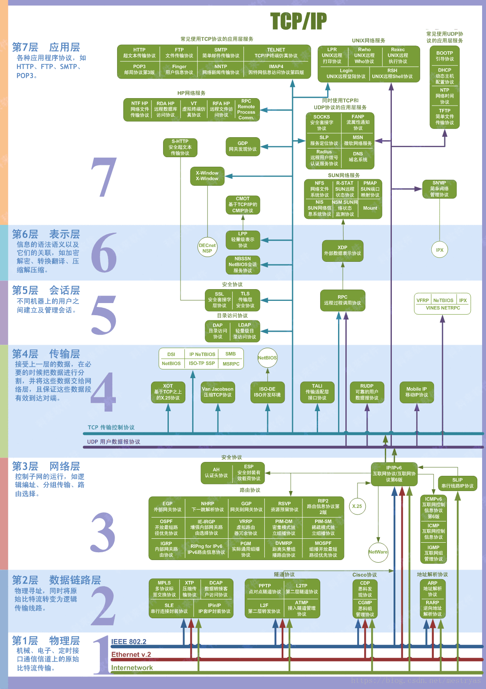
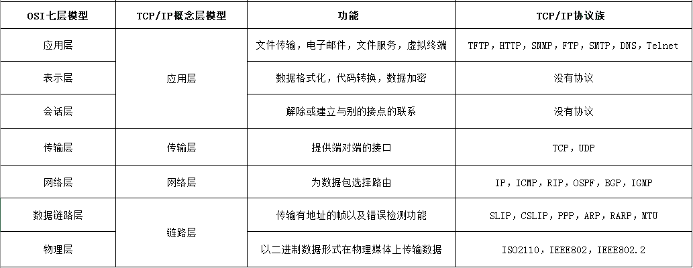
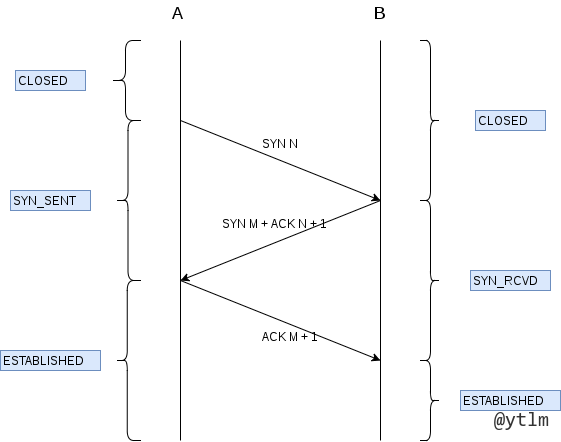
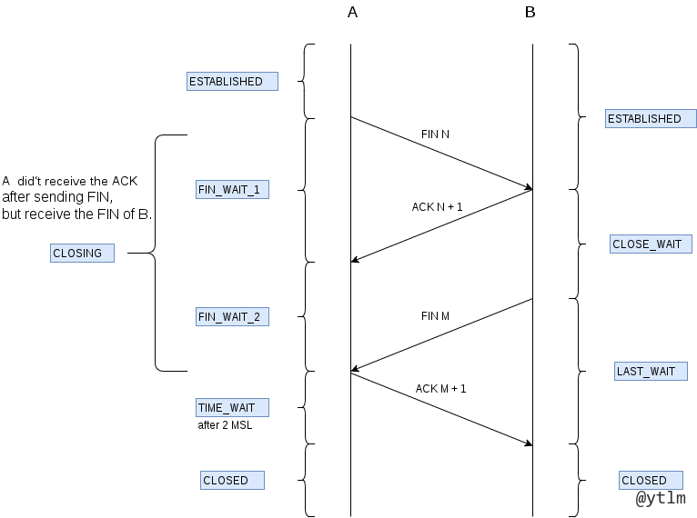
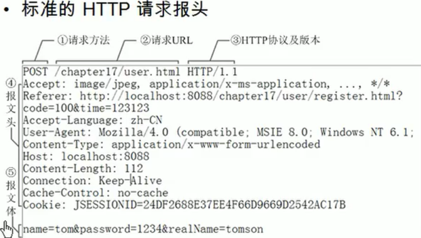
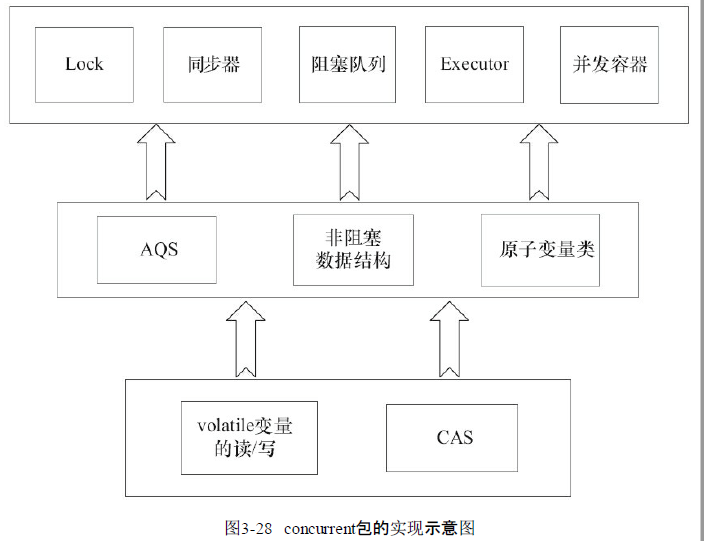
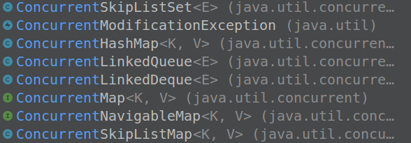

Java研发工程师

[TOC]

## 一、计算机网络

#### 1.OSI、TCP/IP、五层体系结构联系与区别？

（1）三种比较？


（2）七层结构细节？



（3）每一层对应的设备？


#### 2.说一说TCP/IP协议簇？



- 应用层（它是计算机用户，以及各种应用程序和网络之间的接口，其功能是直接向用户提供服务，完成用户希望在网络上完成的各种工作。）
  - SNMP
  - SMTP
- 传输层（向用户提供可靠的端到端的差错和流量控制，保证报文的正确传输。传输层的作用是向高层屏蔽下层数据通信的细节，即向用户透明地传送报文。）
- 网络层（通过路由选择算法，为报文或分组通过通信子网选择最适当的路径。）
  - ICMP
  - IGMP
  - RIP
  - BGP
  - OSPF
- 链路层（通过各种控制协议，将有差错的物理信道变为无差错的、能可靠传输数据帧的数据链路。）
  - ARP，RARP

#### 3.**TCP三次握手的过程？**

```
握手过程可以由客户端调用socket开启，客户端发送SYN和Seq，closed状态变换为SYN_SEND状态，服务器端由LISTEN状态变换为SYN_RECV状态，服务端回送SYN+ACK，客户端接收，客户端状态变为Established，客户端发送ACK，服务端接收到ACK，状态变为Established，至此，TCP三次握手的过程就完成了。
（1）第一次握手：服务端确定（服务端可以接收数据，客户端可以发送数据）
（2）第二次握手：客户端确定（服务端可以接收数据，服务端可以接收数据）
（3）第三次握手：服务端确定（客户端可以接收数据）
以上，（1）（2）（3）是的双方确定彼此可以接收和发送数据。
```



#### 4.TCP四次挥手的过程？

```
关闭连接的过程可以由服务端和客户端的任何一方发起，发起的一方状态变化为：Established------>FIN_WAIT_1------>FIN_WAIT_2------>TIME_WAIT------>CLOSED; 
被动关闭的一方的状态变化为Establised------>CLOSE_WAIT------>LAST_ACK------>CLOSED.
```



#### 5.TCP在三次握手的过程中是如何超时重传的？

```
(1) 如果第一个包，A发送给B请求建立连接的报文(SYN)如果丢掉了，A会周期性的超时重传，直到B发出确认(SYN+ACK)；
(2) 如果第二个包，B发送给A的确认报文(SYN+ACK)如果丢掉了，B会周期性的超时重传，直到A发出确认(ACK)；
(3) 如果第三个包，A发送给B的确认报文(ACK)如果丢掉了，
	- A在发送完确认报文之后，单方面会进入ESTABLISHED的状态，B还是SYN_RCVD状态
	- 如果此时双方都没有数据需要发送，B会周期性的超时发送(SYN+ACK)，直到收到A的确认报文(ACK)，此时B也进入ESTABLISHED状态，双方可以发送数据；
	- 如果A有数据发送，A发送的是(ACK+DATA)，B会在收到这个数据包的时候自动切换到ESTABLISHED状态，并接受数据(DATA)；
	- 如果这个时候B要发送数据，B是发送不了数据的，会周期性的超时重传(SYN+ACK)直到收到A的确认(ACK)B才能发送数据。
```


#### 6.**为什么要三次握手，四次挥手？**

（1）为什么要进行三次握手？
**这是防止已失效的连接请求报文段突然又传送到了B而引发错误。**
举例，客户端A向服务端B发送数据，受到网络状态的影响，可能A发送的数据B很久以后才收到（实际上A已经通过重传机制重新发送了），当这个阻塞的数据到来的时候，B就会误以为这是一个新的连接，则B将等待A，但是实际上A并没有发起新的请求，这就导致了资源的浪费。
（2）为什么要进行四次挥手？
TCP通信是一个双工通信，在结束连接的时候FIN和ACK是分开发送的，A向B发送FIN仅仅表示A不在发送数据，并不表示自己不在接收数据，同理，B向A发送FIN仅仅表示B不在发送数据，但是自己是可以接收数据的。为什么要在发起端加上TIME_WAIT？是为了保证ACK丢失的时候可以重传。

#### 7.**在浏览器地址栏输入一个url到浏览器返回页面的过程？**

```
（1）浏览器解析地址
（2）DNS
（3）建立TCP连接（三次握手）
（4）得到服务器响应数据，浏览器进行渲染
（5）关闭连接（四次挥手）
```

> - 浏览器分析超链指向页面的 URL。
> - 浏览器向 DNS 请求解析 [www.tsinghua.edu.cn](http://www.tsinghua.edu.cn) 的 IP 地址。
> - 域名系统 DNS 解析出清华大学服务器的 IP 地址。
> - 浏览器与服务器建立 TCP 连接
> - 浏览器发出取文件命令：GET /chn/yxsz/index.htm。
> - 服务器给出响应，把文件 index.htm 发给浏览器。
> - TCP 连接释放。
> - 浏览器显示“清华大学院系设置”文件 index.htm 中的所有文本。

#### 8.**说一说在三次握手的时候可能存在的安全问题？**

```
当第二次握手后，服务端将会进入SYN_RECV状态（又叫做半连接状态），通过伪造客户端的地址，这个时候服务器端一直在等待客户端返回ACK，但是由于地址是伪造的，所以根本就无法收到ACK。当这种伪造的连接数量大的时候就会导致DDOS。
```

#### 9.域名解析

m.xyz.com需要查找y.abc.com的IP地址：

> - 主机m.xyz.com向本地域名服务器进行递归查询。
>
>   > 主机向本地域名服务器查询时一般使用递归查询。
>   >
>   > - **递归查询**：就是如果本地域名服务器没有所需域名的IP地址，本地域名服务器就以客户的方式向其他根域名服务器继续查询，而不是主机自己进行查询。
>   >
>   > 本地域名服务器向其他根域名服务器进行查询的时一般使用迭代查询。
>   >
>   > - **迭代查询：** 当某个根域名服务器收到本地域名服务器的请求报文时，要么告诉它所需域名的IP地址，要么告诉它下一步应该向哪个服务器发起询问。然后让本地域名服务器自己去查询。
>
> - 本地域名服务器迭代查询，先向一个根域名服务器查询。
>
> - 根域名服务器告诉本地域名服务器，下一步应该向顶级域名服务器dns.com查询。
>
> - 顶级域名服务器dns.com告诉本地域名服务器，下一步查找权限域名服务器：dns.adc.com。
>
> - 本地域名服务器向权限域名服务器发起查询。权限域名服务器告诉本地服务器所需的IP地址，本地服务器在告诉给本地主机。

#### 10.**TCP是如何保证可靠传输的？**(分编校丢流拥重超)

   ```
   （1）应用数据被TCP分割成为适合发送的数据块
   （2）TCP将会给每一个包进行编号，接收方会对数据进行排序，将有序的数据传输给应用层。
           序列号：TCP传输时将每个字节的数据都进行了编号，这就是序列号。
           确认应答：TCP传输的过程中，每次接收方收到数据后，都会对传输方进行确认应答。也就是发送ACK报文。这个ACK报文当中带有对应的确认序列号，告诉发送方，接收到了哪些数据，下一次的数据从哪里发。
           序列号的作用不仅仅是应答的作用，有了序列号能够将接收到的数据根据序列号排序，并且去掉重复序列号的数据。这也是TCP传输可靠性的保证之一。
   （3）TCP将会保持首部和数据的校验和，目的是检查数据在传输的过程中是否被修改
   （4）丢弃重复发送的数据
   （5）流量控制：TCP连接的每一方都有一个固定的缓冲空间，TCP的接收端只允许发送端发送接收端缓冲区能够容纳的数据，当接收方来不及处理的时候，能够提示发送端降低发送的速率，防止丢包。（TCP使用的是滑动窗口进行流量控制）
   （6）拥塞控制（当网络阻塞的时候，减少数据的发送，拥塞控制就是防止过多的数据注入到网络中，这样使网络中的路由器或者链路不至于过载。）
   （7）自动重传（为了实现可靠的传输，每发送完一个分组就会停止发送，等待对方确认，确认后再发送下一个分组。）
   （8）超时重传（当TCP发出一个分组后，它将启动一个定时器，等待目的端确认接收，如果不及时，将会重传。）
   ```

   

#### 11.**TCP和UDP之间的区别？**(面头流速可有界)

| 区别     | TCP                                   | UDP                                                          |
| -------- | ------------------------------------- | ------------------------------------------------------------ |
| 面向连接 | 面向连接，**TCP不提供广播和多播服务** | 面向无连接，**UDP支持一对一、多对一、一对多、多对多的交互通信。** |
| 头部大小 | 头部至少为20个字节                    | 头部为8个字节                                                |
| 流量控制 | 有流量控制                            | 没有流量控制                                                 |
| 速度     | TCP速度较慢                           | UDP速度较快                                                  |
| 可靠性   | 可靠传输                              | 不可靠传输                                                   |
| 有序     | 有序                                  | 无序                                                         |
| 界       | TCP有界，通过字节流传输               | UDP无界，每一个包是单独传输的，发送方的UDP对应用程序交下来的报文添加首部后直接交付给IP层。UDP对应用层交下来的报文，既不合并，也不拆分，而是保留这些报文的边界。 |
| 适用场景 | 视频                                  | 文件传输                                                     |


#### 12.post和get的区别？

| 区别   | POST                                                   | GET                               |
| ------ | ------------------------------------------------------ | --------------------------------- |
| 可见性 | 数据在url中不可见                                      | 参数在url中可见                   |
| 长度   | 没有长度限制                                           | 有长度限制                        |
| 编码   | application/x-www-form-urlencoded, multipart/form-data | application/x-www-form-urlencoded |
| 缓存   | 不支持                                                 | 支持                              |
| 安全性 | 相对安全                                               | 相对不安全                        |

 

#### 13.**在TCP和UDP之上都有哪些应用层的协议？**

```
TCP：HTTP，HTTPS，SMTP（简单邮件传输协议），POP3，SSH
UDP：DNS，Telnet，SNMP（简单网络管理协议），IGMP（网络组管理协议）,RIP(路由信息协议)，DHCP（动态主机设置协议）
```


#### 14.**HTTPS握手的过程？**

```
（1）客户端给出一个协议版本号、一个客户端生成的随机数（Client random）以及客户端支持的加密算法。（客户端发送了三件东西）
（2）服务端确认双方使用的加密算法，并且给出数字证书，以及一个随机数（server random）。（服务端发送了两件东西）
（3）客户端确认数字证书有效，然后生成一个新的随机数（Premaster secret），并且使用数字证书中的公钥，加密这个随机数，将其发送给服务端。（客户端发送了一个非对称加密的随机数）
（4）服务端使用自己的私钥，获取来自客户端的加密随机数（Premaster secret）。（服务端使用非对称加密算法进行解密）
（5）客户端和服务端根据约定的加密方法，使用前面的三个随机数，生成对话密钥（session key），用来加密整个会话。（服务端使用对称密钥会话）
```


#### 15.**TCP头部，UDP头部比较？**

（1）TCP头部至少由20个字节构成（最长60个），如下图：


（2）UDP头部由8个字节构成，如下图：


#### 16.IP头部


#### 17.HTTP请求，HTTP响应，字段？

（1）HTTP请求

- 请求行
  - 方法，url，协议版本
- 请求首部字段
- 空行（这一个空行一定存在）
- 内容实体



（2）HTTP响应

- 响应行
  - 协议版本，响应状态码，原因短语
- 响应首部字段
- 空行
- 内容实体

（3）字段

- 通用头（通用头域包含请求和响应消息都支持的头域，通用头域包含缓存头部Cache-Control、Pragma及信息性头部Connection、Date、Transfer-Encoding、Update、Via）

| 名字                  | 含义                                                         |
| :-------------------- | ------------------------------------------------------------ |
| **Date**              | Date头域表示消息发送的时间，服务器响应中要包含这个头部，因为缓存在评估响应的新鲜度时要用到，其时间的描述格式由RFC822定义。例如，Date:Mon,31 Dec 2001 04:25:57 GMT。Date描述的时间表示世界标准时，换算成本地时间，需要知道用户所在的时区。 |
| **Transfer-Encoding** | WEB 服务器表明自己对本响应消息体（不是消息体里面的对象）作了怎样的编码，比如是否分块（chunked），例如：Transfer-Encoding: chunked |
| **Pragma**            | Pragma头域用来包含实现特定的指令，最常用的是Pragma:no-cache。在HTTP/1.1协议中，它的含义和Cache- Control:no-cache相同。 |
| **Connection**        | Connection表示是否需要持久连接。                             |
| **Cache-Control**     | Cache-Control指定请求和响应遵循的缓存机制。在请求消息或响应消息中设置 Cache-Control并不会修改另一个消息处理过程中的缓存处理过程。请求时的缓存指令包括no-cache、no-store、max-age、max-stale、min-fresh、only-if-cached，响应消息中的指令包括public、private、no-cache、no-store、no-transform、must-revalidate、proxy-revalidate、max-age。 |
| **Upgrade**           | 它可以指定另一种可能完全不同的协议，如HTTP/1.1客户端可以向服务器发送一条HTTP/1.0请求，其中包含值为“HTTP/1.1”的Update头部，这样客户端就可以测试一下服务器是否也使用HTTP/1.1了。 |
| **Via**               | 列出从客户端到 OCS 或者相反方向的响应经过了哪些代理服务器，他们用什么协议（和版本）发送的请求。 |

- HTTP请求头（请求头用于说明是谁或什么在发送请求、请求源于何处，或者客户端的喜好及能力。服务器可以根据请求头部给出的客户端信息，试着为客户端提供更好的响应。）

| 名字                    | 含义                                                         |
| ----------------------- | ------------------------------------------------------------ |
| **Accept**              | 告诉WEB服务器自己接受什么介质类型，*/* 表示任何类型，type/* 表示该类型下的所有子类型，type/sub-type。 |
| **Accept-Charset**      | 浏览器告诉服务器自己能接收的字符集。                         |
| **Accept-Encoding**     | 浏览器申明自己接收的编码方法，通常指定压缩方法，是否支持压缩，支持什么压缩方法（gzip，deflate）。 |
| **Accept-Language**     | 浏览器申明自己接收的语言。语言跟字符集的区别：中文是语言，中文有多种字符集，比如big5，gb2312，gbk等等。 |
| **Authorization**       | 当客户端接收到来自WEB服务器的 WWW-Authenticate 响应时，用该头部来回应自己的身份验证信息给WEB服务器。 |
| **If-Match**            | 如果对象的 ETag 没有改变，其实也就意味著对象没有改变，才执行请求的动作，获取文档。 |
| **If-None-Match**       | 如果对象的 ETag 改变了，其实也就意味著对象也改变了，才执行请求的动作，获取文档。 |
| **If-Modified-Since**   | 如果请求的对象在该头部指定的时间之后修改了，才执行请求的动作（比如返回对象），否则返回代码304，告诉浏览器该对象没有修改。例如：If-Modified-Since：Thu, 10 Apr 2008 09:14:42 GMT |
| **If-Unmodified-Since** | 如果请求的对象在该头部指定的时间之后没修改过，才执行请求的动作（比如返回对象）。 |
| **If-Range**            | 浏览器告诉 WEB 服务器，如果我请求的对象没有改变，就把我缺少的部分给我，如果对象改变了，就把整个对象给我。浏览器通过发送请求对象的ETag 或者自己所知道的最后修改时间给 WEB 服务器，让其判断对象是否改变了。总是跟 Range 头部一起使用。 |
| **Range**               | 浏览器（比如 Flashget 多线程下载时）告诉 WEB 服务器自己想取对象的哪部分。例如：Range: bytes=1173546 |
| **Proxy-Authenticate**  | 代理服务器响应浏览器，要求其提供代理身份验证信息。           |
| **Proxy-Authorization** | 浏览器响应代理服务器的身份验证请求，提供自己的身份信息。     |
| **Host**                | 客户端指定自己想访问的WEB服务器的域名/IP 地址和端口号。如Host：rss.sina.com.cn |
| **Referer**             | 浏览器向WEB 服务器表明自己是从哪个网页URL获得点击当前请求中的网址/URL，例如：Referer：[http://www.jb51.net](http://www.jb51.net/) |
| **User-Agent**          | 浏览器表明自己的身份（是哪种浏览器）。例如：User-Agent：Mozilla/5.0 (Windows; U; Windows NT 5.1; zh-CN;rv:1.8.1.14) Gecko/20080404 Firefox/2.0.0.14 |

- HTTP响应头（响应头向客户端提供一些额外信息，比如谁在发送响应、响应者的功能，甚至与响应相关的一些特殊指令。这些头部有助于客户端处理响应，并在将来发起更好的请求。）

| 名字              | 含义                                                         |
| ----------------- | ------------------------------------------------------------ |
| **Age**           | 当代理服务器用自己缓存的实体去响应请求时，用该头部表明该实体从产生到现在经过多长时间了。 |
| **Server**        | WEB 服务器表明自己是什么软件及版本等信息。例如：Server：Apache/2.0.61 (Unix) |
| **Accept-Ranges** | WEB服务器表明自己是否接受获取其某个实体的一部分（比如文件的一部分）的请求。bytes：表示接受，none：表示不接受。 |
| **Vary**          | WEB服务器用该头部的内容告诉 Cache 服务器，在什么条件下才能用本响应所返回的对象响应后续的请求。假如源WEB服务器在接到第一个请求消息时，其响应消息的头部为：Content-Encoding:gzip; Vary: Content-Encoding，那么Cache服务器会分析后续请求消息的头部，检查其Accept-Encoding，是否跟先前响应的Vary头部值一致，即是否使用相同的内容编码方法，这样就可以防止Cache服务器用自己Cache里面压缩后的实体响应给不具备解压能力的浏览器。例如：Vary：Accept-Encoding。 |

- HTTP实体头部（实体头部提供了有关实体及其内容的大量信息，从有关对象类型的信息，到能够对资源使用的各种有效的请求方法。总之，实体头部可以告知接收者它在对什么进行处理。请求消息和响应消息都可以包含实体信息，实体信息一般由实体头域和实体组成。实体头域包含关于实体的原信息，实体头包括信息性头部Allow、Location，内容头部Content-Base、Content-Encoding、Content-Language、Content-Length、Content-Location、Content-MD5、Content-Range、Content-Type，缓存头部Etag、Expires、Last-Modified、extension-header。）

| 名字                 | 含义                                                         |
| -------------------- | ------------------------------------------------------------ |
| **Allow**            | 服务器支持哪些请求方法（如GET、POST等）。                    |
| **Location**         | 表示客户应当到哪里去提取文档，用于将接收端定位到资源的位置（URL）上。Location通常不是直接设置的，而是通过HttpServletResponse的sendRedirect方法，该方法同时设置状态代码为302。 |
| **Content-Base**     | 解析主体中的相对URL时使用的基础URL。                         |
| **Content-Encoding** | WEB服务器表明自己使用了什么压缩方法（gzip，deflate）压缩响应中的对象。例如：Content-Encoding：gzip |
| **Content-Language** | WEB 服务器告诉浏览器理解主体时最适宜使用的自然语言。         |
| **Content-Length**   | WEB服务器告诉浏览器自己响应的对象的长度或尺寸，例如：Content-Length: 26012 |
| **Content-Location** | 资源实际所处的位置。                                         |
| **Content-MD5**      | 主体的MD5校验和。                                            |
| **Content-Range**    | 实体头用于指定整个实体中的一部分的插入位置，他也指示了整个实体的长度。在服务器向客户返回一个部分响应，它必须描述响应覆盖的范围和整个实体长度。一般格式：Content-Range:bytes-unitSPfirst-byte-pos-last-byte-pos/entity-legth。例如，传送头500个字节次字段的形式：Content-Range:bytes0-499/1234如果一个http消息包含此节（例如，对范围请求的响应或对一系列范围的重叠请求），Content-Range表示传送的范围，Content-Length表示实际传送的字节数。 |
| **Content-Type**     | WEB 服务器告诉浏览器自己响应的对象的类型。例如：Content-Type：application/xml |
| **Etag**             | 就是一个对象（比如URL）的标志值，就一个对象而言，比如一个html文件，如果被修改了，其Etag也会别修改，所以，ETag的作用跟Last-Modified的作用差不多，主要供WEB服务器判断一个对象是否改变了。比如前一次请求某个html文件时，获得了其<br/>ETag，当这次又请求这个文件时，浏览器就会把先前获得ETag值发送给WEB服务器，然后WEB服务器会把这个ETag跟该文件的当前ETag进行对比，然后就知道这个文件有没有改变了。 |
| **Expires**          | WEB服务器表明该实体将在什么时候过期，对于过期了的对象，只有在跟WEB服务器验证了其有效性后，才能用来响应客户请求。是 HTTP/1.0 的头部。例如：Expires：Sat, 23 May 2009 10:02:12 GMT |
| **Last-Modified**    | WEB服务器认为对象的最后修改时间，比如文件的最后修改时间，动态页面的最后产生时间等等。例如：Last-Modified：Tue, 06 May 2008 02:42:43 GMT |


#### 18.HTTP1.0，HTTP1.1，HTTP2.0之间的区别？

```
（1）HTTP1.0：
- 无法复用连接
- 对头阻塞（head of line blocking）

（2）HTTP1.1：
- 长连接（在头部加入了connection：keep-alive）
- 管道化（将请求队列移动到服务端队列）
- 缓存机制（引入了新的字段cache-control，支持断点重传）
- 增加了host字段（使得一个服务器可创建多个站点）
（3）HTTP2.0：
- 二进制分帧
- 多路复用（消息由一个帧或者多个帧组成，可以乱序进行发送，之后使用帧的stream id进行重组，二进制分帧使得多路复用成为可能，多路复用实现真正的并发）
- 头部压缩，通信双方保存header filed表
- 服务器推送（不用客户端进行明确请求）
```

**新HTTP1.0与HTTP1.1区别：**

> HTTP1.0最早在网页中使用是在1996年，那个时候只是使用一些较为简单的网页上和网络请求上，而HTTP1.1则在1999年才开始广泛应用于现在的各大浏览器网络请求中，同时HTTP1.1也是当前使用最为广泛的HTTP协议。 主要区别主要体现在：
>
> - **缓存处理**，在HTTP1.0中主要使用header里的If-Modified-Since,Expires来做为缓存判断的标准，HTTP1.1则引入了更多的缓存控制策略例如Entity  tag，If-Unmodified-Since, If-Match, If-None-Match等更多可供选择的缓存头来控制缓存策略。
> - **带宽优化及网络连接的使用**，HTTP1.0中，存在一些浪费带宽的现象，例如客户端只是需要某个对象的一部分，而服务器却将整个对象送过来了，并且不支持断点续传功能，HTTP1.1则在请求头引入了range头域，它允许只请求资源的某个部分，即返回码是206（Partial  Content），这样就方便了开发者自由的选择以便于充分利用带宽和连接。
> - **错误通知的管理**，在HTTP1.1中新增了24个错误状态响应码，如409（Conflict）表示请求的资源与资源的当前状态发生冲突；410（Gone）表示服务器上的某个资源被永久性的删除。
> - **Host头处理**，在HTTP1.0中认为每台服务器都绑定一个唯一的IP地址，因此，请求消息中的URL并没有传递主机名（hostname）。但随着虚拟主机技术的发展，在一台物理服务器上可以存在多个虚拟主机（Multi-homed  Web  Servers），并且它们共享一个IP地址。HTTP1.1的请求消息和响应消息都应支持Host头域，且请求消息中如果没有Host头域会报告一个错误（400  Bad Request）。
> - **长连接、持续连接**，HTTP  1.1支持长连接（PersistentConnection）和请求的流水线（Pipelining）处理，在一个TCP连接上可以传送多个HTTP请求和响应，减少了建立和关闭连接的消耗和延迟，在HTTP1.1中默认开启Connection：  keep-alive，一定程度上弥补了HTTP1.0每次请求都要创建连接的缺点。

**HTTP1.1与HTTP2.0的区别：**

> - **新的二进制格式**（Binary  Format），HTTP1.x的解析是基于文本。基于文本协议的格式解析存在天然缺陷，文本的表现形式有多样性，要做到健壮性考虑的场景必然很多，二进制则不同，只认0和1的组合。基于这种考虑HTTP2.0的协议解析决定采用二进制格式，实现方便且健壮。
> - **多路复用**（MultiPlexing），即连接共享，即每一个request都是是用作连接共享机制的。一个request对应一个id，这样一个连接上可以有多个request，每个连接的request可以随机的混杂在一起，接收方可以根据request的  id将request再归属到各自不同的服务端请求里面。
> - **header压缩**，如上文中所言，对前面提到过HTTP1.x的header带有大量信息，而且每次都要重复发送，HTTP2.0使用encoder来减少需要传输的header大小，通讯双方各自cache一份header  fields表，既避免了重复header的传输，又减小了需要传输的大小。
> - **服务端推送**（server push），同SPDY一样，HTTP2.0也具有server push功能

#### 19.cookie和session的区别？**

（1）cookie数据存放在客户的浏览器上，session存放在服务器上。

（2）cookie不是安全的，别人可以分析存放在本地的cookie进行cookie欺骗。

（3）session会一定时间内存放在服务器上，当访问次数增多的时候，会影响性能。

（4）单个cookie保存的数据不会超过4K，很多浏览器限制一个站点的cookie数目不超过20个。

#### 20.**状态码？**

（1）概括：

|      | 类别                             | 原因短语                   |
| ---- | -------------------------------- | -------------------------- |
| 1XX  | Informational（信息状态码）      | 接收的请求正在处理         |
| 2XX  | Success（成功状态码）            | 请求正常处理完毕           |
| 3XX  | Redirection（重定向状态码）      | 需要进行附加操作以完成请求 |
| 4XX  | Client Error（客户端错误状态码） | 服务器无法处理请求         |
| 5XX  | Server Error（服务器错误状态码） | 服务器处理请求出错         |

（2）细节

| 状态码 | 状态码英文名称                  | 中文描述                                                     |
| ------ | ------------------------------- | ------------------------------------------------------------ |
| 100    | Continue                        | 继续。客户端应继续其请求                                     |
| 101    | Switching Protocols             | 切换协议。服务器根据客户端的请求切换协议。只能切换到更高级的协议，例如，切换到HTTP的新版本协议 |
|        |                                 |                                                              |
| 200    | OK                              | 请求成功。一般用于GET与POST请求                              |
| 201    | Created                         | 已创建。成功请求并创建了新的资源                             |
| 202    | Accepted                        | 已接受。已经接受请求，但未处理完成                           |
| 203    | Non-Authoritative Information   | 非授权信息。请求成功。但返回的meta信息不在原始的服务器，而是一个副本 |
| 204    | No Content                      | 无内容。服务器成功处理，但未返回内容。在未更新网页的情况下，可确保浏览器继续显示当前文档 |
| 205    | Reset Content                   | 重置内容。服务器处理成功，用户终端（例如：浏览器）应重置文档视图。可通过此返回码清除浏览器的表单域 |
| 206    | Partial Content                 | 部分内容。服务器成功处理了部分GET请求                        |
|        |                                 |                                                              |
| 300    | Multiple Choices                | 多种选择。请求的资源可包括多个位置，相应可返回一个资源特征与地址的列表用于用户终端（例如：浏览器）选择 |
| 301    | Moved Permanently               | 永久移动。请求的资源已被永久的移动到新URI，返回信息会包括新的URI，浏览器会自动定向到新URI。今后任何新的请求都应使用新的URI代替 |
| 302    | Found                           | 临时移动。与301类似。但资源只是临时被移动。客户端应继续使用原有URI |
| 303    | See Other                       | 查看其它地址。与301类似。使用GET和POST请求查看               |
| 304    | Not Modified                    | 未修改。所请求的资源未修改，服务器返回此状态码时，不会返回任何资源。客户端通常会缓存访问过的资源，通过提供一个头信息指出客户端希望只返回在指定日期之后修改的资源 |
| 305    | Use Proxy                       | 使用代理。所请求的资源必须通过代理访问                       |
| 306    | Unused                          | 已经被废弃的HTTP状态码                                       |
| 307    | Temporary Redirect              | 临时重定向。与302类似。使用GET请求重定向                     |
|        |                                 |                                                              |
| 400    | Bad Request                     | 客户端请求的语法错误，服务器无法理解                         |
| 401    | Unauthorized                    | 请求要求用户的身份认证                                       |
| 402    | Payment Required                | 保留，将来使用                                               |
| 403    | Forbidden                       | 服务器理解请求客户端的请求，但是拒绝执行此请求               |
| 404    | Not Found                       | 服务器无法根据客户端的请求找到资源（网页）。通过此代码，网站设计人员可设置"您所请求的资源无法找到"的个性页面 |
| 405    | Method Not Allowed              | 客户端请求中的方法被禁止                                     |
| 406    | Not Acceptable                  | 服务器无法根据客户端请求的内容特性完成请求                   |
| 407    | Proxy Authentication Required   | 请求要求代理的身份认证，与401类似，但请求者应当使用代理进行授权 |
| 408    | Request Time-out                | 服务器等待客户端发送的请求时间过长，超时                     |
| 409    | Conflict                        | 服务器完成客户端的 PUT 请求时可能返回此代码，服务器处理请求时发生了冲突 |
| 410    | Gone                            | 客户端请求的资源已经不存在。410不同于404，如果资源以前有现在被永久删除了可使用410代码，网站设计人员可通过301代码指定资源的新位置 |
| 411    | Length Required                 | 服务器无法处理客户端发送的不带Content-Length的请求信息       |
| 412    | Precondition Failed             | 客户端请求信息的先决条件错误                                 |
| 413    | Request Entity Too Large        | 由于请求的实体过大，服务器无法处理，因此拒绝请求。为防止客户端的连续请求，服务器可能会关闭连接。如果只是服务器暂时无法处理，则会包含一个Retry-After的响应信息 |
| 414    | Request-URI Too Large           | 请求的URI过长（URI通常为网址），服务器无法处理               |
| 415    | Unsupported Media Type          | 服务器无法处理请求附带的媒体格式                             |
| 416    | Requested range not satisfiable | 客户端请求的范围无效                                         |
| 417    | Expectation Failed              | 服务器无法满足Expect的请求头信息                             |
|        |                                 |                                                              |
| 500    | Internal Server Error           | 服务器内部错误，无法完成请求                                 |
| 501    | Not Implemented                 | 服务器不支持请求的功能，无法完成请求                         |
| 502    | Bad Gateway                     | 作为网关或者代理工作的服务器尝试执行请求时，从远程服务器接收到了一个无效的响应 |
| 503    | Service Unavailable             | 由于超载或系统维护，服务器暂时的无法处理客户端的请求。延时的长度可包含在服务器的Retry-After头信息中 |
| 504    | Gateway Time-out                | 充当网关或代理的服务器，未及时从远端服务器获取请求           |
| 505    | HTTP Version not supported      | 服务器不支持请求的HTTP协议的版本，无法完成处理               |

**1XX——表示通知信息，如请求收到了或正在进行处理**

**2XX——表明请求被正常处理了**

> - 200 OK：请求已正常处理。
> - 204 No Content：请求处理成功，但没有任何资源可以返回给客户端，一般在只需要从客户端往服务器发送信息，而对客户端不需要发送新信息内容的情况下使用。
> - 206 Partial Content：是对资源某一部分的请求，该状态码表示客户端进行了范围请求，而服务器成功执行了这部分的GET请求。响应报文中包含由Content-Range指定范围的实体内容。

**3XX——表明浏览器需要执行某些特殊的处理以正确处理请求**

> - 301 Moved Permanently：资源的uri已更新，你也更新下你的书签引用吧。永久性重定向，请求的资源已经被分配了新的URI，以后应使用资源现在所指的URI。
> - 302 Found：资源的URI已临时定位到其他位置了，姑且算你已经知道了这个情况了。临时性重定向。和301相似，但302代表的资源不是永久性移动，只是临时性性质的。换句话说，已移动的资源对应的URI将来还有可能发生改变。
> - 303  See  Other：资源的URI已更新，你是否能临时按新的URI访问。该状态码表示由于请求对应的资源存在着另一个URL，应使用GET方法定向获取请求的资源。303状态码和302状态码有着相同的功能，但303状态码明确表示客户端应当采用GET方法获取资源，这点与302状态码有区别。当301,302,303响应状态码返回时，几乎所有的浏览器都会把POST改成GET，并删除请求报文内的主体，之后请求会自动再次发送。
> - 304  Not  Modified：资源已找到，但未符合条件请求。该状态码表示客户端发送附带条件的请求时（采用GET方法的请求报文中包含If-Match，If-Modified-Since，If-None-Match，If-Range，If-Unmodified-Since中任一首部）服务端允许请求访问资源，但因发生请求未满足条件的情况后，直接返回304。
> - 307 Temporary Redirect：临时重定向。与302有相同的含义。

**4XX——表明客户端是发生错误的原因所在。**

> - 400 Bad Request：服务器端无法理解客户端发送的请求，请求报文中可能存在语法错误。
> - 401 Unauthorized：该状态码表示发送的请求需要有通过HTTP认证（BASIC认证，DIGEST认证）的认证信息。
> - 403 Forbidden：不允许访问那个资源。该状态码表明对请求资源的访问被服务器拒绝了。（权限，未授权IP等）
> - 404 Not Found：服务器上没有请求的资源。路径错误等。

**5XX——服务器本身发生错误**

> - 500 Internal Server Error：貌似内部资源出故障了。该状态码表明服务器端在执行请求时发生了错误。也有可能是web应用存在bug或某些临时故障。
> - 503 Service Unavailable：抱歉，我现在正在忙着。该状态码表明服务器暂时处于超负载或正在停机维护，现在无法处理请求。

#### 21.TCP是如何实现面向连接的？面向连接和非面向连接的区别？

（1）状态和序列号，以及错误校验。描述TCP和UDP头之间的差异！

#### 22.TCP的拥塞控制？（重传就可能导致拥塞）

（1）慢启动？

（2）拥塞避免？

（3）快重传？

（4）快恢复？

TCP通过**慢启动、拥塞避免、快重传以及快恢复**这四个算法来进行拥塞控制：

> - **慢启动：**一开始先设置一个比较小的拥塞窗口值cwnd（报文段的倍数），然后进行数据传输，每收到一个报文段的确认，我们就将**cwnd+1**，这样下来，cwnd总体上是乘以**2^n**的倍数增长。（慢启动非增长速度慢，只是增长的初始基数比较小）
> - **拥塞避免：** 因为慢启动算法的增长比较快，当cwnd = ssthresh（预先设置好的门限值）时，我们启动拥塞避免算法，窗口值开始线性增长。
>
> > 随着拥塞避免算法的进行，网络出现超时的情况（这时判断为**拥塞出现**）。这时将cwnd降为一开始的值，重新进行**慢开始-拥塞避免**，并且此时的门限值设为出现拥塞时的cwnd的一半。
>
> - **快重传：** 快重传的目的是为了让发送方尽早知道某个报文段的丢失。如何知道呢？**当我们重复收到某一个报文段的3次确认时，我们就可以判断，它的下一个报文段可能出现了丢失**。这时我们启动快重传算法，立即重传丢失的报文段。
> - **快恢复：** 上面快重传算法的启动只是因为个别报文段的丢失，我们这时并不判断为网络拥塞，而是启动快恢复算法。我们将cwnd=ssthresh=当前cwnd的一半，并且开始拥塞避免算法。
>
> > 当然，也有的快恢复算法是将当前拥塞窗口再增大3个报文段的值，因为既然收到了3个重复的ACK，则说明有三个分组已经离开了网络，不在占用网络资源而是停留在对方缓存当中，可以适当将窗口值增大。


#### 23.TCP的流量控制？

滑动窗口协议

#### 24.重传算法？

SACK方法

- 为了解决快速重传的缺点，一种更好的SACK重传策略被提出
- 基于快速重传，同时在tcp头里加了一个SACK的东西
- 解决了什么问题：客户端应该发送哪些超时包的问题

#### 25.路由算法？

（1）路由：找到任意两个节点之间开销最小的路径。

（2）距离向量，链路状态

- 距离向量：网络中没有任何一个节点知道整张表的信息，自己只知道它自己的路由表的内容。好处：所有的节点在没有任何集中授权的额情况下取得网络的一致视图。（RIP协议）
- 链路状态：每一个节点都有足够的信息构建完整的网络映象。（OSPF协议，开放最短路径优先），路由的计算采用迪杰特斯拉算法进行计算。

#### 26.IP数据报格式？


#### 27.ABC类地址

> - A、B、C类IP地址的网络号字段分别是1、2、3个字节长，而在网络号的1-3位是类别位，分别是：0、10、110。
> - A、B、C类IP地址的主机号字段分别为3、2、1个字节。
> - A、B、C类IP地址是单播地址，D类IP地址（前四位为1110）为多播地址，E类IP地址（前四位1111）保留为以后使用。
> - A类地址的网络号中：全0和127是不指派的；主机号中：全0代表本主机所连接的单个网络地址，全1代表网络上的所有主机，也是不指派的。
> - B类IP地址网络号中：**128.0.0.0不指派**；主机号中：全0和全1也不指派。
> - C类IP地址网络号中：**192.0.0.0不指派**；主机号中：全0和全1也不指派。

#### 28.端口号

| 应用程序   | FTP  | TELNET | SMTP | DNS  | TFTP | HTTP | SNMP | SNMP(trap) | HTTPS |
| ---------- | ---- | ------ | ---- | ---- | ---- | ---- | ---- | ---------- | ----- |
| 熟知端口号 | 21   | 23     | 25   | 53   | 69   | 80   | 161  | 162        | 443   |

#### 29.滑动窗口（解决的是速率不匹配问题）

- 解决了什么问题：发送方和接收方速率不匹配时，保证可靠传输和包乱序的问题

- 机制：接收方根据目前缓冲区大小，通知发送方目前能接收的最大值。发送方根据接收方的处理能力来发送数据。通过这种协调机制，防止接收端处理不过来。

- 窗口大小：接收方发给发送端的这个值称为窗口大小

#### 30.拥塞窗口（控制的是发送方）

- 解决什么问题：发送方发送速度过快，导致中转路由器拥堵的问题
- 机制：发送方增加一个拥塞窗口（cwnd），每次受到ack，窗口值加1。发送时，取拥塞窗口和接收方发来的窗口大小取最小值发送
- 起到发送方流量控制的作用

#### 31.细节

- MIME (*M*ultipurpose *I*nternet *M*ail *E*xtensions) 是描述消息内容类型的因特网标准。
- Request For Comments（*RFC*），是一系列以编号排定的文件。文件收集了有关互联网相关信息，以及UNIX和互联网社区的软件文件。
- RIP使用UDP，OSPF使用IP,而BGP使用TCP。
  - OSPF本身提供主从协商机制，可以保证可靠的传输，另外全网路由器保持着同样的一个LSDB（链路状态数据库），当拓扑发生变化时，需要携带的变更信息较少，
  - 通过IP协议即可完成RIP协议采用UDP是因为RIP每周期需全网组播路由信息，路由信息数目较大，故使用UDP协议可以提高效率
  - BGP为边界网关协议，因携带的路由信息较多，且可能跨不同网络传送路由信息，为保证可靠性，需使用TCP协议，可兼顾容量和可靠性

## 二、操作系统

### （一）基础

#### 1.原码、补码、反码

- 原码：原码用第一位表示符号, 其余位表示值. 比如如果是8位二进制
- 补码
  - 正数：正数的补码就是其本身
  - 负数：负数的补码是在其原码的基础上, 符号位不变, 其余各位取反, 最后+1。 (即在反码的基础上+1)
- 反码
  - 正数：正数的反码是其本身
  - 负数：负数的反码是在其原码的基础上, 符号位不变，其余各个位取反.

### （二）并发

#### 1.进程、线程、管程、协程？

（1）线程和进程

线程是程序执行的一条路径，在多线程的OS中，线程是调度和分配的基本单位，而进程是拥有资源的基本单位。

（2）线程的属性

> - **轻型实体**：线程中的实体基本上不拥有系统资源，只是有一点必不可少的、能保证独立运行的资源。线程的实体包括程序、数据和TCB。线程是动态概念，它的动态特性由线程控制块TCB（Thread Control Block）描述。TCB包括以下信息：
>
>   - 线程状态。
>   - 当线程不运行时，被保存的现场资源。
>   - 一组执行堆栈。
>   - 存放每个线程的局部变量主存区。
>   - 访问同一个进程中的主存和其它资源。
>
>   用于指示被执行指令序列的程序计数器、保留局部变量、少数状态参数和返回地址等的一组寄存器和堆栈。
>
> - **独立调度和分派的基本单位**：在多线程OS中，线程是能独立运行的基本单位，因而也是独立调度和分派的基本单位。由于线程很“轻”，故线程的切换非常迅速且开销小（在同一进程中的）。
>
> - **可并发执行**：在一个进程中的多个线程之间，可以并发执行，甚至允许在一个进程中所有线程都能并发执行；同样，不同进程中的线程也能并发执行，充分利用和发挥了处理机与外围设备并行工作的能力。
>
> - **共享进程资源**：在同一进程中的各个线程，都可以共享该进程所拥有的资源，这首先表现在：所有线程都具有相同的地址空间（进程的地址空间），这意味着，线程可以访问该地址空间的每一个虚地址；此外，还可以访问进程所拥有的已打开文件、定时器、信号量机构等。由于同一个进程内的线程共享内存和文件，所以线程之间互相通信不必调用内核。

#### 2.进程之间的通信？（套共消，管信信）

（1）套接字

（2）共享内存

（3）消息队列

（4）管程

（5）信号

（6）信号量

> **信号量**
>
> 是一个确定的二元组（s，q），其中s是一个具有非负初值的整形变量，q是一个初始状态为空的队列，整形变量s表示系统中某类资源的数目：
>
> - 当其值 `>= 0` 时，表示系统中当前可用资源的数目
> - 当其值 `< 0` 时，其绝对值表示系统中因请求该类资源而被阻塞的进程数目
>
> 除信号量的初值外，信号量的值仅能由P操作和V操作更改，操作系统利用它的状态对进程和资源进行管理
>
> ##### P操作
>
> P操作记为P(s)，其中s为一信号量，它执行时主要完成以下动作：
>
> ```
> s.value = s.value - 1；  /*可理解为占用1个资源，若原来就没有则记帐“欠”1个*/
> ```
>
> 若`s.value ≥ 0`，则进程继续执行，否则（即s.value < 0），则进程被阻塞，并将该进程插入到信号量s的等待队列s.queue中
>
> > 实际上，P操作可以理解为分配资源的计数器，或是使进程处于等待状态的控制指令
>
> ##### V操作
>
> V操作记为V(s)，其中s为一信号量，它执行时，主要完成以下动作：
>
> ```
> s.value = s.value + 1；/*可理解为归还1个资源，若原来就没有则意义是用此资源还1个欠帐*/
> ```
>
> 若`s.value > 0`，则进程继续执行，否则（即s.value ≤ 0），则从信号量s的等待队s.queue中移出第一个进程，使其变为就绪状态，然后返回原进程继续执行
>
> > 实际上，V操作可以理解为归还资源的计数器，或是唤醒进程使其处于就绪状态的控制指令      

#### 3.信号和信号量之间的区别？

- 信号量：（Semaphore）进程间通信处理同步互斥的机制。是在多线程环境下使用的一种设施, 它负责协调各个线程, 以保证它们能够正确、合理的使用公共资源。（特点，pv操作，用于同步进程）
- 信号：（signal）是一种处理异步事件的方式。信号是比较复杂的通信方式，用于通知接受进程有某种事件发生，除了用于进程外，还可以发送信号给进程本身。（特点，通知）

#### 4.线程之间的通信？

（1）锁机制

（2）信号量机制

（3）信号机制

#### 5.死锁产生的条件？

（1）互斥

（2）请求与保持:指进程已经保持至少一个资源，但又提出了新的资源请求，而该资源已被其它进程占有，此时请求进程阻塞，但又对自己已获得的其它资源保持不放。

（3）循环等待

（4）不可剥夺

#### 6.死锁的解除和预防的方法？

- 死锁避免:银行家算法

#### 7.调度

（1）调度策略

- `响应时间`：从用户输入到产生反应的时间
- `周转时间`：从任务开始到任务结束的时间
- `平均周转时间`：周转总时间除以作业个数

（2）调度算法(8种)

- [1] FCFS：调度的顺序就是任务到达就绪队列的顺序。对短作业不公平。

  > 公平、简单(FIFO队列)、非抢占、不适合交互式。未考虑任务特性，平均等待时间可以缩短

- [2] SJF：最短的作业(CPU区间长度最小)最先调度。

  > 可以证明，SJF可以保证最小的平均等待时间。

- [3] SRJF：SJF的可抢占版本，比SJF更有优势。

     SJF(SRJF): 如何知道下一CPU区间大小？根据历史进行预测: 指数平均法。

- [4] HRN：最高响应比优先法，是FCFS和SJF的综合平衡，响应比R定义如下： `R =(W+T)/T` 。

- [5] 优先权调度：每个任务关联一个优先权，调度优先权最高的任务。

  > 注意：优先权太低的任务一直就绪，得不到运行，出现“饥饿”现象。
  >
  > FCFS是RR的特例，SJF是优先权调度的特例。这些调度算法都不适合于交互式系统。

- [6] Round-Robin(RR)：设置一个时间片，按时间片来轮转调度

  > 优点: 定时有响应，等待时间较短；缺点: 上下文切换次数较多；
  >
  > 时间片太大，响应时间太长；吞吐量变小，周转时间变长；当时间片过长时，退化为FCFS。

- [7] 多级队列调度

  > - 按照一定的规则建立多个进程队列
  > - 不同的队列有固定的优先级（高优先级有抢占权）
  > - 不同的队列可以给不同的时间片和采用不同的调度方法
  >
  > 存在问题1：没法区分I/O bound和CPU bound；
  >
  > 存在问题2：也存在一定程度的“饥饿”现象；

- [8] 多级反馈队列：在多级队列的基础上，任务可以在队列之间移动，更细致的区分任务。可以根据“享用”CPU时间多少来移动队列，阻止“饥饿”。

  > 最通用的调度算法，多数OS都使用该方法或其变形，如UNIX、Windows等。

#### 8.锁

（1）互斥锁

> 同一时间只能有一个线程访问加锁的数据。

（2）自旋锁

> 互斥锁的一种实现，如果自旋锁已经被别的执行单元保持，调用者就一直 **循环等待** 是否该自旋锁的保持者已经释放了锁。

（3）读写锁

> 一种特殊的自旋锁，它把对共享资源的访问者划分成读者和写者，读者只对共享资源进行读访问，写者则需要对共享资源进行写操作。**写者是排他性的，一个读写锁同时只能有一个写者或多个读者（与CPU数相关），但不能同时既有读者又有写者**。

（4）阻塞锁

> 与自旋锁不同，改变了线程的运行状态。**让线程进入阻塞状态进行等待，当获得相应的信号（唤醒，时间） 时，才可以进入线程的准备就绪状态**，准备就绪状态的所有线程，通过竞争，进入运行状态。
>
> > 在Java中synchronized,ReentrantLock,Object.wait() / notify()都属于阻塞锁。

（5）可重入锁

> 也叫做递归锁，指的是同一线程上该锁是可重入的，对于不同线程则相当于普通的互斥锁。

（6）公平锁

> 加锁前检查是否有排队等待的线程，优先排队等待的线程，先来先得。

（7）非公平锁

> 加锁时不考虑排队等待问题，直接尝试获取锁，获取不到自动到队尾等待。`ReentrantLock`中的`lock()`默认就是非公平锁。

（8）悲观锁

> 假定会发生并发冲突，屏蔽一切可能违反数据完整性的操作。加锁的时间可能会很长，也就是说悲观锁的并发访问性不好。

（9）乐观锁

> 假设不会发生并发冲突，只在提交操作时检查是否违反数据完整性。乐观锁不能解决脏读的问题，可以通过添加时间戳和版本来来解决。

#### 9.CAS

> 比较并交换(compare and swap, CAS)**，是原子操作的一种，可用于在多线程编程中实现不被打断的数据交换操作。**该操作通过将内存中的值与指定数据进行比较，当数值一样时将内存中的数据替换为新的值。
>
> 在使用上，通常会记录下某块内存中的旧值，通过对旧值进行一系列的操作后得到新值，然后通过CAS操作将新值与旧值进行交换。**如果这块内存的值在这期间内没被修改过，则旧值会与内存中的数据相同，这时CAS操作将会成功执行使内存中的数据变为新值**。如果内存中的值在这期间内被修改过，则一般来说旧值会与内存中的数据不同，这时CAS操作将会失败，新值将不会被写入内存。

### （三）内存管理

1. 页面置换算法
   - **FIFO算法**：先入先出，即淘汰最早调入的页面。
   - **OPT(MIN)算法**：选未来最远将使用的页淘汰，是一种最优的方案，可以证明缺页数最小。可惜，MIN需要知道将来发生的事，只能在理论中存在，实际不可应用。
   - **LRU(Least-Recently-Used)算法**：用过去的历史预测将来，选最近最长时间没有使用的页淘汰(也称最近最少使用)。性能最接近OPT。**与页面使用时间有关**。
   - **LFU(Least Frequently Used)算法**：即最不经常使用页置换算法，要求在页置换时置换引用计数最小的页，因为经常使用的页应该有一个较大的引用次数。**与页面使用次数有关**。
   - **Clock**：给每个页帧关联一个使用位，当该页第一次装入内存或者被重新访问到时，将使用位置为1。每次需要替换时，查找使用位被置为0的第一个帧进行替换。在扫描过程中，如果碰到使用位为1的帧，将使用位置为0，在继续扫描。如果所谓帧的使用位都为0，则替换第一个帧。

### （四）I/O

#### 1.I/O模式？[参考](https://segmentfault.com/a/1190000003063859)

（1）阻塞I/O（blocking IO）

> 当用户进程调用了 `recvfrom` 这个系统调用， `kernel` 就开始了 IO 的第一个阶段：准备数据（对于网络IO来说，很多时候数据在一开始还没有到达。比如，还没有收到一个完整的 `UDP` 包。这个时候 `kernel` 就要等待足够的数据到来）。这个过程需要等待，也就是说数据被拷贝到操作系统内核的缓冲区中是需要一个过程的。而在用户进程这边，整个进程会被阻塞（当然，是进程自己选择的阻塞）。当 `kernel` 一直等到数据准备好了，它就会将数据从 `kernel` 中拷贝到用户内存，然后 `kernel` 返回结果，用户进程才解除 `block` 的状态，重新运行起来。
>
> > blocking IO的特点就是在IO执行的两个阶段都被block了

（2）非阻塞I/O（nonblocking IO）

> 当用户进程发出 `read` 操作时，如果 `kernel` 中的数据还没有准备好，那么它并不会 `block` 用户进程，而是立刻返回一个 `error` 。从用户进程角度讲 ，它发起一个 `read` 操作后，并不需要等待，而是马上就得到了一个结果。用户进程判断结果是一个 `error` 时，它就知道数据还没有准备好，于是它可以再次发送 `read` 操作。一旦 `kernel` 中的数据准备好了，并且又再次收到了用户进程的 `system call` ，那么它马上就将数据拷贝到了用户内存，然后返回。
>
> > nonblocking IO的特点是用户进程需要不断的主动询问kernel数据好了没有
> >
> > NIO**和****IO****之间一个最大区别：****IO****是面向流的，****NIO****是面向缓冲区的。**

（3）I/O多路复用（ IO multiplexing）（Java中的NIO使用channel来完成多路复用）

> IO multiplexing就是我们说的select，poll，epoll，有些地方也称这种IO方式为event driven IO。select/epoll的好处就在于单个process就可以同时处理多个网络连接的IO。它的基本原理就是select，poll，epoll这个function会不断的轮询所负责的所有socket，当某个socket有数据到达了，就通知用户进程。
>
> > 所以，I/O 多路复用的特点是通过一种机制一个进程能同时等待多个文件描述符，而这些文件描述符（套接字描述符）其中的任意一个进入读就绪状态，select()函数就可以返回。

（4）信号驱动I/O（ signal driven IO）

（5）异步I/O（asynchronous IO）（并不会加快io的过程）

> 用户进程发起 `read` 操作之后，立刻就可以开始去做其它的事。而另一方面，从 `kernel` 的角度，当它受到一个 `asynchronous read` 之后，首先它会立刻返回，所以不会对用户进程产生任何 `block` 。然后，`kernel` 会等待数据准备完成，然后将数据拷贝到用户内存，当这一切都完成之后，`kernel` 会给用户进程发送一个 `signal` ，告诉它 `read` 操作完成了。

#### 2.零拷贝zero-copy是什么？如何实现？

（1）用户态和内核态？

（2）零拷贝实现？

#### 3.同步异步，阻塞非阻塞的区别。

（阻塞，非阻塞指的有无返回值，同步异步指的是能否继续执行）无论阻塞式IO还是非阻塞式IO，都是同步IO模型，区别就在与第一步是否完成后才返回，但第二步都需要当前进程去完成，异步IO呢，就是从第一步开始就返回，直到第二步完成后才会返回一个消息，也就是说，非阻塞能够让你在第一步时去做其它的事情，而真正的异步IO能让你第二步的过程也能去做其它事情.

### （五）linux使用

#### 1.CPU占用过高排查

>（1）top
>
>（2）ps -ef | grep java或者jps定位
>
>（3）定位到具体的线程：ps -mp 进程 -o THREAD,tid,time
>
>（4）将线程ID转换为16进制的格式：print "%x\n" 数字
>
>（5）jstack 进程id | grep tid（16进制线程id的小写）-A60

#### 2.补充：

- 计算机硬件由运算器、控制器、存储器、输入设备和输出设备五大部分组成。
- 操作系统的五大功能，分别为：`作业管理`、`文件管理`、`存储管理`、`输入输出设备管理`、`进程及处理机管理`
- 中断：所谓的中断就是在计算机执行程序的过程中，由于出现了某些特殊事情，使得CPU暂停对程序的执行，转而去执行处理这一事件的程序。等这些特殊事情处理完之后再回去执行之前的程序。中断一般分为三类：
  - `内部异常中断`：由计算机硬件异常或故障引起的中断；
  - `软中断`：由程序中执行了引起中断的指令而造成的中断（这也是和我们将要说明的系统调用相关的中断）；
  - `外部中断`：由外部设备请求引起的中断，比如I/O请求。
- 系统调用：进程的执行在系统上的两个级别：用户级和核心级，也称为`用户态`和`系统态`(`user mode` and `kernel mode`)。**程序的执行一般是在用户态下执行的，但当程序需要使用操作系统提供的服务时，比如说打开某一设备、创建文件、读写文件等，就需要向操作系统发出调用服务的请求，这就是系统调用**。

#### 3.awk命令的使用？


## 三、数据结构

1. B-树，B+树，AVL树？

## 四、算法

1. 算法的分类？
2. 弗洛伊德算法？
3. 迪杰斯特拉算法？

## 五、Java

### （一）基础

#### 1.泛型？

#### 2.内部类？（成局静匿）

（1）成员内部类

> 一个类定义在一个类的内部，看起来像类的成员。
>
> > 问题：
> >
> > - 有隐藏的问题
> > - 访问：成员内部类可以无条件地访问外部类的成员，而外部类想访问成员内部类的成员却不是这么随心所欲了。在外部类中如果要访问成员内部类的成员，必须先创建一个成员内部类的对象，再通过指向这个对象的引用来访问

（2）局部内部类

> 定义在方法或者是一个作用域内，和成员内部类的区别在于访问权限上。
>
> > 问题：
> >
> > - 局部内部类是定义在一个方法或者一个作用域里面的类，它和成员内部类的区别在于局部内部类的访问仅限于方法内或者该作用域内。
> > - 是不能有 public、protected、private 以及 static 修饰符的。

（3）静态内部类

> 静态内部类也是定义在另一个类里面的类，只不过在类的前面多了一个关键字static。静态内部类是不需要依赖于外部类的，这点和类的静态成员属性有点类似，`并且它不能使用外部类的非static成员变量或者方法`
>
> > - 静态内部类是不依赖于外部类的，也就说可以在不创建外部类对象的情况下创建内部类的对象。

（4）匿名内部类

> 一般使用匿名内部类的方法来编写事件监听代码。同样的，匿名内部类也是不能有访问修饰符和 static 修饰符的。

#### 3.构造器能不能override？

不可以，可以重载，不可以重写，理由：父类的私有属性以及构造器不能够被重载。

#### 4.StringBuffer怎么实现线程安全的？

对方法或者被调用的方法加了同步锁。


#### 5.static相关？（目的：方便在没有new的情况下使用方法和属性）

（1）修饰？

- 类
- 方法：是没有this的，因为它不依附于任何对象，在静态方法中不能访问类的非静态成员变量和非静态成员方法，因为非静态成员方法/变量都是必须依赖具体的对象才能够被调用。非静态成员方法中是可以访问静态成员方法/变量的。
- 属性：静态变量被所有的对象所共享，在内存中只有一个副本，它当且仅当在类初次加载时会被初始化。而非静态变量是对象所拥有的，在创建对象的时候被初始化，存在多个副本，各个对象拥有的副本互不影响。
- 代码块：用来形成静态代码块以优化程序性能。static块可以置于类中的任何地方，类中可以有多个static块。在类初次被加载的时候，会按照static块的顺序来执行每个static块，并且只会执行一次。

（2）特点

- 在static方法内部不能调用非静态方法。

- 例题：

```java
/**
 * @Author MaoTian
 * @Classname StaticTest
 * @Description static使用
 *
 * test static
 * myclass static
 * person static
 * person Test
 * test constructor
 * person MyClass
 * myclass constructor
 *
 * @Date 下午8:23 2019/8/12
 * @Version 1.0
 * @Created by mao<tianmao818@qq.com>
 */

class Person{
    static{
        System.out.println("person static");
    }
    public Person(String str) {
        System.out.println("person "+str);
    }
}

//StaticTest已经加载过了
//而在生成对象的时候，必须先初始化父类的成员变量，因此会执行Test中的Person person = new Person()
class MyClass extends StaticTest {
    
    Person person = new Person("MyClass");
    //（3）被加载
    static{
        System.out.println("myclass static");
    }
    public MyClass() {
        System.out.println("myclass constructor");
    }
}

//
public class StaticTest  {
    Person person = new Person("Test");

    //（1）首先被加载
    static{
        System.out.println("test static");
    }

    public StaticTest() {
        System.out.println("test constructor");
    }
    
    public static void main(String[] args) {
        //（2）被执行
        new MyClass();
    }
```

#### 6.接口和抽象类的区别？

（1）接口？

- 一个类可以实现多个接口。
- 接口中除了static、final变量，不能有其他变量，不能够有方法的实现，java 8开始支持default。
- 接口默认是：public的
- 从设计上讲：抽象是对类的抽象

（2）抽象类？

- 一个类只能继承一个抽象类。
- 抽象类中可以有属性以及方法的实现。
- 从设计上讲：是对行为的抽象。
- 抽象方法可以有public、protected和default这些修饰符（抽象方法就是为了被重写所以不能使用private关键字修饰！）

#### 7.equals和hashcode的区别？

- 如果两个对象相等，则hashcode一定也是相同的

- 两个对象相等,对两个对象分别调用equals方法都返回true

- 两个对象有相同的hashcode值，它们也不一定是相等的

- **因此，equals 方法被覆盖过，则 hashCode 方法也必须被覆盖**

- hashCode() 的默认行为是对堆上的对象产生独特值。如果没有重写 hashCode()，则该 class 的两个对象无论如何都不会相等（即使这两个对象指向相同的数据）
- 注意equas值相等并不是说hashcode就会一样！！！equals方法是可以自行定义的！并不是equals相等，两个对象就相等。

#### 8.Throwable类？

（1）结构？

> java.lang
>
> ## Class Throwable
>
> - [java.lang.Object](https://docs.oracle.com/javase/8/docs/api/java/lang/Object.html)
> - - java.lang.Throwable
>
> - - All Implemented Interfaces:
>
>     [Serializable](https://docs.oracle.com/javase/8/docs/api/java/io/Serializable.html)
>
>   - Direct Known Subclasses:
>
>     [Error](https://docs.oracle.com/javase/8/docs/api/java/lang/Error.html), [Exception](https://docs.oracle.com/javase/8/docs/api/java/lang/Exception.html)
>
> > 常用的方法：
> >
> > - **public string getMessage()**:返回异常发生时的详细信息
> > - **public string toString()**:返回异常发生时的简要描述
> > - **public string getLocalizedMessage()**:返回异常对象的本地化信息。使用Throwable的子类覆盖这个方法，可以声称本地化信息。如果子类没有覆盖该方法，则该方法返回的信息与getMessage（）返回的结果相同
> > - **public void printStackTrace()**:在控制台上打印Throwable对象封装的异常信息

（2）常见的异常和错误？

- 异常
  - ArithmeticException
  - IndexOutOfBoundsException
  - RuntimeException
  - NullPointerException
- 错误
  - OutOfMemoryError
  - StackOverflowError

| **编号** | **异常Exception**                                            | **错误Error**                                                |
| -------- | ------------------------------------------------------------ | ------------------------------------------------------------ |
| 1        | [ArithmeticException](https://docs.oracle.com/javase/8/docs/api/java/lang/ArithmeticException.html) | [AbstractMethodError](https://docs.oracle.com/javase/8/docs/api/java/lang/AbstractMethodError.html) |
| 2        | [ArrayIndexOutOfBoundsException](https://docs.oracle.com/javase/8/docs/api/java/lang/ArrayIndexOutOfBoundsException.html) | [AssertionError](https://docs.oracle.com/javase/8/docs/api/java/lang/AssertionError.html) |
| 3        | [ArrayStoreException](https://docs.oracle.com/javase/8/docs/api/java/lang/ArrayStoreException.html) | [BootstrapMethodError](https://docs.oracle.com/javase/8/docs/api/java/lang/BootstrapMethodError.html) |
| 4        | [ClassCastException](https://docs.oracle.com/javase/8/docs/api/java/lang/ClassCastException.html) | [ClassCircularityError](https://docs.oracle.com/javase/8/docs/api/java/lang/ClassCircularityError.html) |
| 5        | [ClassNotFoundException](https://docs.oracle.com/javase/8/docs/api/java/lang/ClassNotFoundException.html) | [ClassFormatError](https://docs.oracle.com/javase/8/docs/api/java/lang/ClassFormatError.html) |
| 6        | [CloneNotSupportedException](https://docs.oracle.com/javase/8/docs/api/java/lang/CloneNotSupportedException.html) | [Error](https://docs.oracle.com/javase/8/docs/api/java/lang/Error.html) |
| 7        | [EnumConstantNotPresentException](https://docs.oracle.com/javase/8/docs/api/java/lang/EnumConstantNotPresentException.html) | [ExceptionInInitializerError](https://docs.oracle.com/javase/8/docs/api/java/lang/ExceptionInInitializerError.html) |
| 8        | [Exception](https://docs.oracle.com/javase/8/docs/api/java/lang/Exception.html) | [IllegalAccessError](https://docs.oracle.com/javase/8/docs/api/java/lang/IllegalAccessError.html) |
| 9        | [IllegalAccessException](https://docs.oracle.com/javase/8/docs/api/java/lang/IllegalAccessException.html) | [IncompatibleClassChangeError](https://docs.oracle.com/javase/8/docs/api/java/lang/IncompatibleClassChangeError.html) |
| 10       | [IllegalArgumentException](https://docs.oracle.com/javase/8/docs/api/java/lang/IllegalArgumentException.html) | [InstantiationError](https://docs.oracle.com/javase/8/docs/api/java/lang/InstantiationError.html) |
| 11       | [IllegalMonitorStateException](https://docs.oracle.com/javase/8/docs/api/java/lang/IllegalMonitorStateException.html) | [InternalError](https://docs.oracle.com/javase/8/docs/api/java/lang/InternalError.html) |
| 12       | [IllegalStateException](https://docs.oracle.com/javase/8/docs/api/java/lang/IllegalStateException.html) | [LinkageError](https://docs.oracle.com/javase/8/docs/api/java/lang/LinkageError.html) |
| 13       | [IllegalThreadStateException](https://docs.oracle.com/javase/8/docs/api/java/lang/IllegalThreadStateException.html) | [NoClassDefFoundError](https://docs.oracle.com/javase/8/docs/api/java/lang/NoClassDefFoundError.html) |
| 14       | [IndexOutOfBoundsException](https://docs.oracle.com/javase/8/docs/api/java/lang/IndexOutOfBoundsException.html) | [NoSuchFieldError](https://docs.oracle.com/javase/8/docs/api/java/lang/NoSuchFieldError.html) |
| 15       | [InstantiationException](https://docs.oracle.com/javase/8/docs/api/java/lang/InstantiationException.html) | [NoSuchMethodError](https://docs.oracle.com/javase/8/docs/api/java/lang/NoSuchMethodError.html) |
| 16       | [InterruptedException](https://docs.oracle.com/javase/8/docs/api/java/lang/InterruptedException.html) | [OutOfMemoryError](https://docs.oracle.com/javase/8/docs/api/java/lang/OutOfMemoryError.html) |
| 17       | [NegativeArraySizeException](https://docs.oracle.com/javase/8/docs/api/java/lang/NegativeArraySizeException.html) | [StackOverflowError](https://docs.oracle.com/javase/8/docs/api/java/lang/StackOverflowError.html) |
| 18       | [NoSuchFieldException](https://docs.oracle.com/javase/8/docs/api/java/lang/NoSuchFieldException.html) | [ThreadDeath](https://docs.oracle.com/javase/8/docs/api/java/lang/ThreadDeath.html) |
| 19       | [NoSuchMethodException](https://docs.oracle.com/javase/8/docs/api/java/lang/NoSuchMethodException.html) | [UnknownError](https://docs.oracle.com/javase/8/docs/api/java/lang/UnknownError.html) |
| 20       | [NullPointerException](https://docs.oracle.com/javase/8/docs/api/java/lang/NullPointerException.html) | [UnsatisfiedLinkError](https://docs.oracle.com/javase/8/docs/api/java/lang/UnsatisfiedLinkError.html) |
| 21       | [NumberFormatException](https://docs.oracle.com/javase/8/docs/api/java/lang/NumberFormatException.html) | [UnsupportedClassVersionError](https://docs.oracle.com/javase/8/docs/api/java/lang/UnsupportedClassVersionError.html) |
| 22       | [ReflectiveOperationException](https://docs.oracle.com/javase/8/docs/api/java/lang/ReflectiveOperationException.html) | [VerifyError](https://docs.oracle.com/javase/8/docs/api/java/lang/VerifyError.html) |
| 23       | [RuntimeException](https://docs.oracle.com/javase/8/docs/api/java/lang/RuntimeException.html) | [VirtualMachineError](https://docs.oracle.com/javase/8/docs/api/java/lang/VirtualMachineError.html) |
| 24       | [SecurityException](https://docs.oracle.com/javase/8/docs/api/java/lang/SecurityException.html) |                                                              |
| 25       | [StringIndexOutOfBoundsException](https://docs.oracle.com/javase/8/docs/api/java/lang/StringIndexOutOfBoundsException.html) |                                                              |
| 26       | [TypeNotPresentException](https://docs.oracle.com/javase/8/docs/api/java/lang/TypeNotPresentException.html) |                                                              |
| 27       | [UnsupportedOperationException](https://docs.oracle.com/javase/8/docs/api/java/lang/UnsupportedOperationException.html) |                                                              |

#### 

#### 9.Collections和Arrays常见的方法？https://gitee.com/SnailClimb/JavaGuide/blob/master/docs/java/Basis/Arrays,CollectionsCommonMethods.md


### （二）容器

#### 1.HashMap的遍历？

#### 2.ArrayList的扩容？

#### 3.HashMap的扩容？

### （三）并发

#### 1.Java内存模型？

#### 2.单例模式的实现？

- 懒汉模式（双重检查加锁）

```java
public class Singleton {
    private volatile static Singleton uniqueInstance;
    private Singleton(){}
    public static Singleton getUniqueInstance(){
        if(uniqueInstance==null){
            synchronized (Singleton.class){
                if(uniqueInstance==null){
                    uniqueInstance=new Singleton();
                }
            }
        }
        return uniqueInstance;
    }
}
```

- 静态内部类模式

```java
public class Singleton2 {
    private static final class SingleHandler{
        private static final Singleton2 INSTANCE=new Singleton2();
    }
    private Singleton2(){}
    public static Singleton2 getInstance(){
        return SingleHandler.INSTANCE;
    }
}
```


#### 3.线程的实现方式？怎么使用lambda的形式？

（1）Thread------------run()方法

（2）Runnable------------run()方法

（3）Callable----------call()----------FutureTask

```java
package JavaBasic;

import java.util.concurrent.Callable;
import java.util.concurrent.ExecutionException;
import java.util.concurrent.FutureTask;

/**
 * @Classname ThreadTest
 * @Description 多线程的三种实现方式
 * @Date 19-7-22 上午9:30
 * @Created by mao<tianmao818@qq.com>
 */

class MyThread1 extends Thread{
    @Override
    public void run(){
        System.out.println("thread by extends Thread");
    }
}

class MyThread2 implements Runnable{
    @Override
    public void run(){
        System.out.println("thread by implements Runnable");
    }
}

class MyThread3 implements Callable{
    @Override
    public String call() throws Exception{
        return "thread by implements Callable";
    }
}

public class ThreadTest {
    public static void main(String[] args){
        MyThread1 myThread1=new MyThread1();
        myThread1.start();

        MyThread2 myThread2=new MyThread2();
        new Thread(myThread2).start();
        
        //FutureTask的使用
        //Future类的使用
        FutureTask<String> futureTask=new FutureTask<>(new MyThread3());
        new Thread(futureTask).start();
        try {
            String res=futureTask.get();
            System.out.println(res);
        } catch (InterruptedException e) {
            e.printStackTrace();
        } catch (ExecutionException e) {
            e.printStackTrace();
        }
    }
}
```

(4)使用匿名内部类

```java
        new Thread(()->{
            System.out.println(Thread.currentThread()+"thread by lambda");
        }).start();

        new Thread() {
            public void run() {
                System.out.println(Thread.currentThread()+"thread by 1");
            }
        }.start();

        Runnable r = new Runnable() {//创建方式2
            public void run() {
                System.out.println(Thread.currentThread()+"thread by 2");
            }
        };
        new Thread(r).start();
```


#### 4.线程池

- ThreadPoolExecutor参数(7个参数)

  > - @param corePoolSize                                核心线程池中的最大线程数
  >
  > - @param maximumPoolSize                      总线程池中的最大线程数
  >
  > - @param keepAliveTime                              空闲线程的存活时间
  >
  > - @param unit                                                 keepAliveTime的单位
  >
  > - @param workQueue                                   任务队列, 保存已经提交但尚未被执行的线程
  >
  > - @param threadFactory                               线程工厂(用于指定如果创建一个线程)
  >
  > - @param handler                                           拒绝策略 (当任务太多导致工作队列满时的处理策略)

- 线程池的状态（高三位表示状态，第29位表示线程的数量）

  > RUNNING                                                              -1 接受新任务, 且处理已经进入阻塞队列的任务
  >
  > SHUTDOWN                                                           0 不接受新任务, 但处理已经进入阻塞队列的任务
  >
  > STOP                                                                        1 接受新任务, 且不处理已经进入阻塞队列的任务, 同时中断正在运行的任务
  >
  > TIDYING                                                                  2 所有任务都已终止, 工作线程数为0, 线程转化为TIDYING状态并准备调用terminated方法
  >
  > TERMINATED                                                          3 terminated方法已经执行完成

- execute执行流程图

  
  
  > 场景：今天是周末，一银行网点只开放了几个窗口，当前值班窗口的数量就是核心线程池的上限。一开始，顾客陆续进来，值班的窗口还有空闲的，则进来一个人就可以直接去柜台办理。随着人数的增加，当天值班窗口全部有人在办理业务，这个时候有人进来，就要在大厅里找个座位坐下来等待，大厅的座位就是阻塞队列。但是，当天人数越来越多，连大厅的座位都坐满了人，这个时候这个网点领导将会通知将当天休息的窗口也打开（所有的窗口数目就是总的线程池上限），当人数还继续增加的话，处于安全考虑，银行就会拒绝继续进入，这就是执行了拒绝策略。

#### 5.Java 并发包提供了哪些并发工具类？

- juc-locks 锁框架

  > juc-locks锁框架中一共就三个接口：Lock、Condition、ReadWriteLock
  >
  > >  ReadWriteLock: 一个单独的接口（未继承Lock接口），该接口提供了获取读锁和写锁的方法。
  > >
  > > ReentrantLock：ReentrantLock内部通过内部类实现了AQS框架(AbstractQueuedSynchronizer)的API来实现**独占锁**的功能。
  > >
  > > ReentrantReadWriteLock：ReentrantReadWriteLock使得多个读线程同时持有读锁（只要写锁未被占用），而写锁是独占的。写锁可以降级成读锁，读锁不能升级成写锁。

  

- juc-atomic 原子类框架（ J.U.C之atomic框架：Unsafe类）

  > 其实底层就是通过Unsafe类实现的一种比较并交换的算法，大致的结构如下（具体入参，根据上下文有所不同）：
  > `boolean compareAndSet(expectedValue, updateValue);`
  > 当希望修改的值与expectedValue相同时，则尝试将值更新为updateValue，更新成功返回true，否则返回false。
  >
  > > Unsafe类，来源于`sun.misc`包。该类封装了许多类似指针操作，可以直接进行内存管理、操纵对象、阻塞/唤醒线程等操作。Java本身不直接支持指针的操作，所以这也是该类命名为Unsafe的原因之一。

- juc-sync 同步器框架

- juc-collections 集合框架

  

- juc-executors 执行器框架

  - 线程池
  - Future模式,Future接口仅仅定义了5个方法。
  
  
  
  - Fork/Join框架


(1)提供了比 synchronized 更加高级的各种同步结构

> 包括 CountDownLatch、CyclicBarrier、Sempahore 等，可以实现更加丰富的多线程操作，比如利用 Semaphore 作为资源控制器，限制同时进行工作的线程数量。
>
> > - CountDownLatch，允许一个或多个线程等待某些操作完成
> >
> > - CyclicBarrier，一种辅助性的同步结构，允许多个线程等待到达某个屏障
> >
> > > - CountDownLatch 是不可以重置的，所以无法重用；而 CyclicBarrier 则没有这种限制，可以重用。
> > > - CountDownLatch 的基本操作组合是 countDown/await。调用 await 的线程阻塞等待countDown 足够的次数，不管你是在一个线程还是多个线程里 countDown，只要次数足够即可。所以就像 Brain Goetz 说过的，CountDownLatch 操作的是事件。
> > > - CyclicBarrier 的基本操作组合，则就是 await，当所有的伙伴（parties）都调用了 await，才会继续进行任务，并自动进行重置。
> >
> > - Semaphore，Java 版本的信号量实现,总的来说，Semaphore 就是个计数器，其基本逻辑基于 acquire/release.

(2)各种线程安全的容器

> 比如最常见的 ConcurrentHashMap、有序的ConcunrrentSkipListMap，或者通过类似快照机制，实现线程安全的动态数组CopyOnWriteArrayList 等。
>
> > Concurrent
> >
> > CopyOnWrite
> >
> > Blocking

(3)并发队列实现

> 如各种 BlockedQueue 实现，比较典型的 ArrayBlockingQueue、SynchorousQueue 或针对特定场景的 PriorityBlockingQueue 等。

(4)强大的 Executor 框架

> 可以创建各种不同类型的线程池，调度任务运行等，绝大部分情况下，不再需要自己从头实现线程池和任务调度器

(5)AQS框架(AbstractQueuedSynchronizer抽象类)

> > - AQS利用了模板方法模式，其中大多数方法都是final或是private的，我们把这类方法称为**Skeleton Method**，也就是说这些方法是AQS框架自身定义好的骨架，子类是不能覆写的。
> > - 支持中断、超时
> > - 支持独占模式和共享模式
> > - 支持Condition条件等待
>
> AQS方法说明:
>
> > - CAS操作
> >
> > - 等待队列的核心操作
> >
> > - 资源的获取操作
> >
> > - 资源的释放操作
>
> 三个基本问题：
>
> > - 同步状态（synchronization state）的管理
> > - 阻塞/唤醒线程的操作
> > - 线程等待队列的管理
>
> CLH队列
>
> > CLH队列中的结点是对线程的包装，结点一共有两种类型：独占（EXCLUSIVE）和共享（SHARED）。
> > 每种类型的结点都有一些状态，其中独占结点使用其中的CANCELLED(1)、SIGNAL(-1)、CONDITION(-2)，共享结点使用其中的CANCELLED(1)、SIGNAL(-1)、PROPAGATE(-3)。
>
> Node节点

#### 6.哪些队列是有界的，哪些是无界的？从源码的角度，常见的线程安全队列是如何实现的，并进行了哪些改进以提高性能表现？

(1)有界or无界

> - ArrayBlockingQueue 是最典型的的有界队列，其内部以 final 的数组保存数据，数组的大小就决定了队列的边界，所以我们在创建 ArrayBlockingQueue 时，都要指定容量
> - LinkedBlockingQueue，容易被误解为无边界，但其实其行为和内部代码都是基于有界的逻辑实现的，只不过如果我们没有在创建队列时就指定容量，那么其容量限制就自动被设置为
>   Integer.MAX_VALUE，成为了无界队列。
> - SynchronousQueue，每个删除操作都要等待插入操作，反之每个插入操作也都要等待删除动作。那么这个队列的容量是多少呢？是 1 吗？其实不是的，其内部容量是 0。
> - PriorityBlockingQueue 是无边界的优先队列，虽然严格意义上来讲，其大小总归是要受系统资源影响
> - DelayedQueue 和 LinkedTransferQueue 同样是无边界的队列。

(2)安全?

> - BlockingQueue 基本都是基于锁实现
> - 类似 ConcurrentLinkedQueue 等，则是基于 CAS 的无锁技术，不需要在每个操作时使用锁，所以扩展性表现要更加优异

#### 7.生产者 - 消费者?

（1）传统版synchronized: sync--------------->wait------------->notify

（2）传统版lock： lock---------->await---------->Signal

（3）阻塞队列

> ```
> * 1 线程    操作   资源类
> * 2 判断    干活   通知
> * 3 虚假唤醒
> ```

```java
package JavaDemo.MultiThreadTest;

/**
 * @Author MaoTian
 * @Classname ProducerConsumerSync
 * @Description TODO
 * @Date 上午8:48 2019/8/9
 * @Version 1.0
 * @Created by mao<tianmao818@qq.com>
 */
class ShareSource{
    private int number=0;
    public synchronized void increment()throws InterruptedException{
        while (number!=0){
            this.wait();
        }
        ++number;
        System.out.println(Thread.currentThread().getName()+"\t"+number);
        this.notifyAll();
    }
    public synchronized void decrement()throws InterruptedException{
        while (number==0){
            this.wait();
        }
        --number;
        System.out.println(Thread.currentThread().getName()+"\t"+number);
        this.notifyAll();
    }
}
public class ProducerConsumerSync {
    public static void main(String[] args) {
        ShareSource shareSource=new ShareSource();
        new Thread(()->{
            for (int i = 0; i <10 ; i++) {
                try {
                    shareSource.increment();
                }catch (Exception e){

                }
            }
        },"producer-1").start();
        new Thread(()->{
            for (int i = 0; i <10 ; i++) {
                try {
                    shareSource.decrement();
                }catch (Exception e){

                }
            }
        },"consumer-1").start();
    }
}

```


```java
class ShareData{
    private int number=0;
    private Lock lock=new ReentrantLock();
    private Condition condition=lock.newCondition();
    public void increment()throws Exception{
        lock.lock();
        try{
            //判断,不能够使用if判断，必须使用while判断
            while (number!=0){
                //等待
                condition.await();
            }
            //干活
            number++;
            System.out.println(Thread.currentThread().getName()+":"+number);
            //通知
            condition.signalAll();
        }catch (Exception e){
        }finally {
            lock.unlock();
        }
    }
    public void decrement()throws Exception{
        lock.lock();
        try{
            //判断
            while (number==0){
                //等待
                condition.await();
            }
            //干活
            number--;
            System.out.println(Thread.currentThread().getName()+":"+number);
            //通知
            condition.signalAll();
        }catch (Exception e){
        }finally {
            lock.unlock();
        }
    }
}
public class ProducerConsumerTraditional {
    public static void main(String[] args) {
        ShareData shareData=new ShareData();
        new Thread(()->{
            for (int i = 0; i < 5; i++) {
                try {
                    shareData.increment();
                } catch (Exception e) {
                    e.printStackTrace();
                }
            }
        },"producer").start();

        new Thread(()->{
            for (int i = 0; i < 5; i++) {
                try {
                    shareData.decrement();
                } catch (Exception e) {
                    e.printStackTrace();
                }
            }
        },"consumer").start();
    }
}
```

```java
package JavaDemo.MultiThreadTest;

import java.util.concurrent.ArrayBlockingQueue;
import java.util.concurrent.BlockingQueue;
import java.util.concurrent.TimeUnit;
import java.util.concurrent.atomic.AtomicInteger;

/**
 * @Author MaoTian
 * @Classname ProducerConsumerBlockingQueue
 * @Description 使用阻塞队列，生产一个消费一个
 * @Date 下午8:51 2019/8/8
 * @Version 1.0
 * @Created by mao<tianmao818@qq.com>
 */

class Resource{
    private volatile boolean FLAG=true; //可见性
    private AtomicInteger atomicInteger=new AtomicInteger();//原子类
    BlockingQueue<String> blockingQueue=null;//阻塞队列

    public Resource(BlockingQueue<String> blockingQueue){
        this.blockingQueue=blockingQueue;
        System.out.println(blockingQueue.getClass().getName());
    }
    public void myProd()throws Exception{
        String data=null;
        boolean retvalue;
        while (FLAG){
            data=atomicInteger.incrementAndGet()+"";
            retvalue=blockingQueue.offer(data,2L, TimeUnit.SECONDS);
            if(retvalue){
                System.out.println(Thread.currentThread()+":insert ok "+data);
            }else{
                System.out.println(Thread.currentThread()+":insert fail");
            }
//            TimeUnit.SECONDS.sleep(1);
        }
        System.out.println(Thread.currentThread()+":producer stop");
    }

    public void myCons()throws Exception{
        String result;
        while (FLAG){
            result=blockingQueue.poll(2L, TimeUnit.SECONDS);
            if(null==result||result.equalsIgnoreCase("")){
                FLAG=false;
                System.out.println(Thread.currentThread()+":consumer stop");
                return;
            }
            System.out.println(Thread.currentThread()+":consume ok "+result);
        }
    }

    public void stop(){
        this.FLAG=false;
    }
}
public class ProducerConsumerBlockingQueue {
    public static void main(String[] args) throws InterruptedException {
        Resource resource=new Resource(new ArrayBlockingQueue<>(10));
        new Thread(()->{
            System.out.println(Thread.currentThread().getName()+" producer start");
            try {
                resource.myProd();
            }catch (Exception e){

            }
        },"producer").start();
        new Thread(()->{
            System.out.println(Thread.currentThread().getName()+" consumer start");
            try {
                resource.myCons();
            }catch (Exception e){

            }
        },"consumer").start();

        TimeUnit.SECONDS.sleep(5);
        resource.stop();
    }
}

```

#### 8.synchronized和lock的区别？用lock的好处？

| 区别           | synchronized                                                 | lock                                                         |
| -------------- | ------------------------------------------------------------ | ------------------------------------------------------------ |
| 原始构成       | （关键字）jvm层面，底层通过monitor对象来完成，monitorenter和monitorexit（两个monitorexit） | （具体类）Lock是具体的类（java.concurrent.locks.Lock）,是api层面的锁（使用java p） |
| 使用方法       | 自动释放                                                     | 需要使用try、finally释放                                     |
| 等待是否可中断 | 不可以被中断                                                 | 可以被中断                                                   |
| 加锁是否公平   | 非公平锁                                                     | 默认是非公平锁，构造函数传参，true公平，false非公平          |
| 锁绑定多个条件 | 没有                                                         | 可以用来实现分组唤醒需要唤醒的线程，可以精确唤醒，synchronized随机唤醒一个或者多个 |

```java
import java.util.concurrent.locks.Condition;
import java.util.concurrent.locks.Lock;
import java.util.concurrent.locks.ReentrantLock;

/**
 * @Author MaoTian
 * @Classname SyncAndLockCondition
 * @Description lock可以绑定多个condition，可以精确唤醒A-B-C-D-A
 * @Date 下午8:23 2019/8/8
 * @Version 1.0
 * @Created by mao<tianmao818@qq.com>
 */
class ShareResource{
    private int number=0; //A=1,B=2,C=3
    //
    private Lock lock=new ReentrantLock();
    private Condition c1=lock.newCondition();
    private Condition c2=lock.newCondition();
    private Condition c3=lock.newCondition();
    //
    public void print_5(){
        lock.lock();
        try {
            while (number!=0){
                c1.await();
            }
            for (int i = 0; i <5 ; i++) {
                System.out.println(Thread.currentThread()+":"+number);
            }
            number=1;
            c2.signal();
        }catch (Exception e){
        }finally {
            lock.unlock();
        }
    }
    //
    public void print_10(){
        lock.lock();
        try {
            while (number!=1){
                c2.await();
            }
            for (int i = 0; i <10 ; i++) {
                System.out.println(Thread.currentThread()+":"+number);
            }
            number=2;
            c3.signal();
        }catch (Exception e){
        }finally {
            lock.unlock();
        }
    }
    public void print_15(){
        lock.lock();
        try {
            while (number!=2){
                c3.await();
            }
            for (int i = 0; i <15 ; i++) {
                System.out.println(Thread.currentThread()+":"+number);
            }
            number=0;
            c1.signal();
        }catch (Exception e){

        }finally {
            lock.unlock();
        }
    }
}
public class SyncAndLockCondition {
    public static void main(String[] args) {
        ShareResource shareResource=new ShareResource();
        new Thread(()->{
            for (int i = 0; i <10 ; i++) {
                shareResource.print_5();
            }
        }).start();
        new Thread(()->{
            for (int i = 0; i <10 ; i++) {
                shareResource.print_10();
            }
        }).start();
        new Thread(()->{
            for (int i = 0; i <10 ; i++) {
                shareResource.print_15();
            }
        }).start();
    }
}

```

#### 9.JUC主要包含的内容？[[透彻理解Java并发编程](https://segmentfault.com/blog/ressmix_multithread)](https://segmentfault.com/blog/ressmix_multithread)

（1）概览



- CopyOnWrite*(List,Set)


- Concurrent*(SkipListSet,SkipListMap,Map,LinkedQueue)

  

- Blocking*(Queue, Deque)(Array,Linked,Priority)


(2)并发容器

| List，Set                                                    | Map                                            | Queue                                                        |
| ------------------------------------------------------------ | ---------------------------------------------- | ------------------------------------------------------------ |
| CopyOnWriteArrayList<br>CopyOnWriteArraySet<br>ConcurrentSkipListSet<br> | ConcurrentHashMap<br>ConcurrentSkipListMap<br> | ArrayBlockingQueue<br>LinkedBlockingQueue<br>ConcurrentLinkedQueue<br>ConcurrentLinkedDeque<br> |

| 类                    | ji(Ctrl+H,Alt+7)                                             | 并发                                                         |                                            |
| --------------------- | ------------------------------------------------------------ | ------------------------------------------------------------ | ------------------------------------------ |
| CopyOnWriteArrayList  | Cloneable (java.lang)<br/>List (java.util)<br/>    Collection (java.util)<br/>        Iterable (java.lang)<br/>Object (java.lang)<br/>RandomAccess (java.util)<br/>Serializable (java.io) |    | ReentrantLock                              |
| CopyOnWriteArraySet   | AbstractSet (java.util)<br/>    AbstractCollection (java.util)<br/>        Collection (java.util)<br/>            Iterable (java.lang)<br/>        Object (java.lang)<br/>    Set (java.util)<br/>        Collection (java.util)<br/>Serializable (java.io) | * A {@link java.util.Set} that uses an internal {@link CopyOnWriteArrayList} * for all of its operations.<br>  Thus, it shares the same basic properties*<br/> | ReentrantLock                              |
| ConcurrentSkipListSet | AbstractSet (java.util)<br/>    AbstractCollection (java.util)<br/>        Collection (java.util)<br/>            Iterable (java.lang)<br/>        Object (java.lang)<br/>    Set (java.util)<br/>        Collection (java.util)<br/>            Iterable (java.lang)<br/>Cloneable (java.lang)<br/>NavigableSet (java.util)<br/>    SortedSet (java.util)<br/>        Set (java.util)<br/>            Collection (java.util)<br/>                Iterable (java.lang)<br/>Serializable (java.io) |                                                              |                                            |
| ConcurrentHashMap     | AbstractMap (java.util)<br/>    Map (java.util)<br/>    Object (java.lang)<br/>`ConcurrentMap (java.util.concurrent)`<br/>    Map (java.util)<br/>Serializable (java.io) |                 | JDK1.8:<br>Node + CAS + Synchronized       |
| ConcurrentSkipListMap | AbstractMap (java.util)<br/>    Map (java.util)<br/>    Object (java.lang)<br/>Cloneable (java.lang)<br/>ConcurrentNavigableMap (java.util.concurrent)<br/>    ConcurrentMap (java.util.concurrent)<br/>        Map (java.util)<br/>    `NavigableMap (java.util)`<br/>        SortedMap (java.util)<br/>            Map (java.util)<br/>Serializable (java.io) |                                                              |                                            |
| ArrayBlockingQueue    | AbstractQueue (java.util)<br/>    AbstractCollection (java.util)<br/>        Collection (java.util)<br/>            Iterable (java.lang)<br/>        Object (java.lang)<br/>    Queue (java.util)<br/>        Collection (java.util)<br/>            Iterable (java.lang)<br/>BlockingQueue (java.util.concurrent)<br/>    Queue (java.util)<br/>        Collection (java.util)<br/>            Iterable (java.lang)<br/>Serializable (java.io) |     | Lock+Condition                             |
| LinkedBlockingQueue   | AbstractQueue (java.util)<br/>    AbstractCollection (java.util)<br/>        Collection (java.util)<br/>            Iterable (java.lang)<br/>        Object (java.lang)<br/>    Queue (java.util)<br/>        Collection (java.util)<br/>            Iterable (java.lang)<br/>BlockingQueue (java.util.concurrent)<br/>    Queue (java.util)<br/>        Collection (java.util)<br/>            Iterable (java.lang)<br/>Serializable (java.io) | ArrayBlockingQueue与LinkedBlockingQueue的比较?<br>相同点：<br>ArrayBlockingQueue和LinkedBlockingQueue都是通过condition通知机制来实现可阻塞式插入和删除元素，并满足线程安全的特性；<br>ArrayBlockingQueue底层是采用的数组进行实现，而LinkedBlockingQueue则是采用链表数据结构；<br>不同点:<br>ArrayBlockingQueue插入和删除数据，只采用了一个lock，而LinkedBlockingQueue则是在插入和删除分别采用了`putLock`和`takeLock`，<br>这样可以降低线程由于线程无法获取到lock而进入WAITING状态的可能性，从而提高了线程并发执行的效率。 |                                            |
| ConcurrentLinkedQueue | AbstractQueue (java.util)<br/>    AbstractCollection (java.util)<br/>        Collection (java.util)<br/>            Iterable (java.lang)<br/>        Object (java.lang)<br/>    Queue (java.util)<br/>        Collection (java.util)<br/>            Iterable (java.lang)<br/>Queue (java.util)<br/>    Collection (java.util)<br/>        Iterable (java.lang)<br/>Serializable (java.io) |   | 无锁算法，底层基于**自旋+CAS**的方式实现。 |
| ConcurrentLinkedDeque | AbstractCollection (java.util)<br/>    Collection (java.util)<br/>        Iterable (java.lang)<br/>    Object (java.lang)<br/>Deque (java.util)<br/>    Queue (java.util)<br/>        Collection (java.util)<br/>            Iterable (java.lang)<br/>Serializable (java.io) |                                                              |                                            |


> - CopyOnWrite*：只有两个
> - Concurrent*
> - Blocking*

(3)ConcurrentHashMap


```java
    final V putVal(K key, V value, boolean onlyIfAbsent) {
        //不允许 key或value为null
        if (key == null || value == null) throw new NullPointerException();
        //计算hash值
        int hash = spread(key.hashCode());
        int binCount = 0;
        //死循环 何时插入成功 何时跳出
        for (Node<K,V>[] tab = table;;) {
            Node<K,V> f; int n, i, fh;
            //如果table为空的话，初始化table 
            if (tab == null || (n = tab.length) == 0)
                tab = initTable();
            //根据hash值计算出在table里面的位置
            else if ((f = tabAt(tab, i = (n - 1) & hash)) == null) {
                //如果这个位置没有值 ，直接放进去，不需要加锁
                if (casTabAt(tab, i, null,
                             new Node<K,V>(hash, key, value, null)))
                    break;                   // no lock when adding to empty bin
            }
            //当遇到表连接点时，需要进行整合表的操作
            else if ((fh = f.hash) == MOVED)
                tab = helpTransfer(tab, f);
            else {
                V oldVal = null;
                //结点上锁  这里的结点可以理解为hash值相同组成的链表的头结点
                synchronized (f) {
                    if (tabAt(tab, i) == f) {
                        if (fh >= 0) {
                            binCount = 1;
                            //在这里遍历链表所有的结点
                            for (Node<K,V> e = f;; ++binCount) {
                                K ek;
                                //如果hash值和key值相同  则修改对应结点的value值 
                                if (e.hash == hash &&
                                    ((ek = e.key) == key ||
                                     (ek != null && key.equals(ek)))) {
                                    oldVal = e.val;
                                    if (!onlyIfAbsent)
                                        e.val = value;
                                    break;
                                }
                                Node<K,V> pred = e;
                                 //如果遍历到了最后一个结点，那么就证明新的节点需要插入 就把它插入在链表尾部
                                if ((e = e.next) == null) {
                                    pred.next = new Node<K,V>(hash, key,
                                                              value, null);
                                    break;
                                }
                            }
                        }
                        //如果这个节点是树节点，就按照树的方式插入值
                        else if (f instanceof TreeBin) {
                            Node<K,V> p;
                            binCount = 2;
                            if ((p = ((TreeBin<K,V>)f).putTreeVal(hash, key,
                                                           value)) != null) {
                                oldVal = p.val;
                                if (!onlyIfAbsent)
                                    p.val = value;
                            }
                        }
                    }
                }
                //如果链表长度已经达到临界值8 就需要把链表转换为树结构
                if (binCount != 0) {
                    if (binCount >= TREEIFY_THRESHOLD)
                        treeifyBin(tab, i);
                    if (oldVal != null)
                        return oldVal;
                    break;
                }
            }
        }
        //将当前ConcurrentHashMap的元素数量+1
        addCount(1L, binCount);
        return null;
    }
```


(5) Demo()

### （四）JVM

### （五）I/O

#### 1.InputStream,OutputStream,Reader,Writer？

> - InputStream,OutputStream:面向字节流
>
> - Reader,Writer:面向字符流
>
> > 操作对象(文件,数组,基本数据类型,缓冲,管道,打印,对象序列化,转化)
> >
> > - (1)文件
> >
> > > FileInputStream
> > > FileOutputStream
> > > FileReader
> > > FileWriter
> >
> > - (2)数组
> >
> > > ByteArrayInputStream
> > > ByteArrayOutputStream
> > > CharArrayReader
> > > CharArrayWriter
> >
> > - (3)基本数据类型
> >
> > > DataInputStream
> > > DataOutputStream
> >
> > - (4)缓冲
> >
> > > BufferedInputStream
> > > BufferedOutputStream
> > > BufferedReader
> > > BufferedWriter
> >
> > - (5)管道
> >
> > > PipedInputStream
> > > PipedOutputStream
> > > PipedReader
> > > PipedWriter
> >
> > - (6)打印
> >
> > > printStream
> > > printWriter
> >
> > - (7)对象序列化
> >
> > > ObjectInputStream
> > > ObjectOutputStream
> >
> > - (8)转化
> >
> > > InputStreamReader
> > > OutputStreamWriter

#### 2.I/O

- java 中 IO 流分为几种?
  - 按照流的流向分，可以分为输入流和输出流；
  - 按照操作单元划分，可以划分为字节流和字符流；
  - 按照流的角色划分为节点流和处理流。

- Java Io流共涉及40多个类， Java I0流的40多个类都是从如下4个抽象类基类中派生出来的。
  - InputStream/Reader: 所有的输入流的基类，前者是字节输入流，后者是字符输入流。
  - OutputStream/Writer: 所有输出流的基类，前者是字节输出流，后者是字符输出流。

#### 3.Java NIO和IO之间第一个最大的区别是，IO是面向流的，NIO是面向缓冲区的

| IO              | NIO             |
| --------------- | --------------- |
| Stream oriented | Buffer oriented |
| Blocking IO     | No blocking IO  |
|                 | Selectors       |

> 面向流和面向缓冲区比较(Stream Oriented vs. Buffer Oriented)
>
> > 第一个重大差异是IO是面向流的，而NIO是面向缓存区的。这句话是什么意思呢？
> >
> > Java IO面向流意思是我们每次从流当中读取一个或多个字节。怎么处理读取到的字节是我们自己的事情。他们不会再任何地方缓存。再有就是我们不能在流数据中向前后移动。如果需要向前后移动读取位置，那么我们需要首先为它创建一个缓存区。
> >
> > Java NIO是面向缓冲区的，这有些细微差异。数据是被读取到缓存当中以便后续加工。我们可以在缓存中向向后移动。这个特性给我们处理数据提供了更大的弹性空间。当然我们任然需要在使用数据前检查缓存中是否包含我们需要的所有数据。另外需要确保在往缓存中写入数据时避免覆盖了已经写入但是还未被处理的数据。
>
> 阻塞和非阻塞IO比较（Blocking vs. No-blocking IO）
>
> > Java IO的各种流都是阻塞的。这意味着一个线程一旦调用了read(),write()方法，那么该线程就被阻塞住了，知道读取到数据或者数据完整写入了。在此期间线程不能做其他任何事情。
> >
> > Java NIO的非阻塞模式使得线程可以通过channel来读数据，并且是返回当前已有的数据，或者什么都不返回如果但钱没有数据可读的话。这样一来线程不会被阻塞住，它可以继续向下执行。
> >
> > 通常线程在调用非阻塞操作后，会通知处理其他channel上的IO操作。因此一个线程可以管理多个channel的输入输出。

#### 4.NIO和AIO的对比？

> - NIO是同步非阻塞的，AIO是异步非阻塞的
> - 由于NIO的读写过程依然在应用线程里完成，所以对于那些读写过程时间长的，NIO就不太适合。而AIO的读写过程完成后才被通知，所以AIO能够胜任那些重量级，读写过程长的任务。

NIO:http://wiki.jikexueyuan.com/project/java-nio-zh/java-nio-non-blocking-server.html

#### 5.Channel，Buffer,Seletor?

(1)Channel

> - FileChannel
>
> > 在Java NIO中如果一个channel是FileChannel类型的，那么他可以直接把数据传输到另一个channel。逐个特性得益于FileChannel包含的transferTo和transferFrom两个方法。
> >
> > > transferFrom():FileChannel.transferFrom方法把数据从通道源传输到FileChannel：
> > >
> > > ```java
> > > RandomAccessFile fromFile = new RandomAccessFile("fromFile.txt", "rw");
> > > FileChannel      fromChannel = fromFile.getChannel();
> > > 
> > > RandomAccessFile toFile = new RandomAccessFile("toFile.txt", "rw");
> > > FileChannel      toChannel = toFile.getChannel();
> > > 
> > > long position = 0;
> > > long count    = fromChannel.size();
> > > 
> > > toChannel.transferFrom(fromChannel, position, count);
> > > ```
> > >
> > > transferTo():transferTo方法把FileChannel数据传输到另一个channel,下面是案例：
> > >
> > > ```java
> > > RandomAccessFile fromFile = new RandomAccessFile("fromFile.txt", "rw");
> > > FileChannel      fromChannel = fromFile.getChannel();
> > > 
> > > RandomAccessFile toFile = new RandomAccessFile("toFile.txt", "rw");
> > > FileChannel      toChannel = toFile.getChannel();
> > > 
> > > long position = 0;
> > > long count    = fromChannel.size();
> > > 
> > > fromChannel.transferTo(position, count, toChannel);
> > > ```
>
> - DatagramChannel
> - SocketChannel
> - ServerSocketChannel
>
> > FileChannel用于文件的数据读写。
> > DatagramChannel用于UDP的数据读写。
> > SocketChannel用于TCP的数据读写。
> > ServerSocketChannel允许我们监听TCP链接请求，每个请求会创建会一个SocketChannel.

(2)Buffer(7)

> - ByteBuffer
> - MappedBytesBuffer,一般用于和内存映射的文件。
> - CharBuffer
> - DoubleBuffer
> - FloatBuffer
> - IntBuffer
> - LongBuffer
> - ShortBuffer
>
> > 利用Buffer读写数据，通常遵循四个步骤：
> >
> > - 把数据写入buffer；
> > - 调用flip；
> > - 从Buffer中读取数据；
> > - 调用buffer.clear()或者buffer.compact(), clear会清空整个buffer，compact则只清空已读取的数据
>
> 一个Buffer有三个属性是必须掌握的，分别是：
>
> > - capacity容量
> > - position位置
> > - limit限制
>
> 分配一个Buffer（Allocating a Buffer）
>
> > ```
> > ByteBuffer buf = ByteBuffer.allocate(48);
> > ```
>
> 写入数据到Buffer（Writing Data to a Buffer）
>
> > - 从Channel中写数据到Buffer
> > - 手动写数据到Buffer，调用put方法
> >
> > > ```
> > > int bytesRead = inChannel.read(buf); //read into buffer.
> > > ```
> > >
> > > ```
> > > buf.put(127);    
> > > ```
>
> 翻转flip()
>
> > flip()方法可以吧Buffer从写模式切换到读模式。调用flip方法会把position归零，并设置limit为之前的position的值。也就是说，现在position代表的是读取位置，limit标示的是已写入的数据位置。
>
> 从Buffer读取数据（Reading Data from a Buffer）
>
> > - 从buffer读数据到channel
> > - 从buffer直接读取数据，调用get方法
> >
> > ```
> > //read from buffer into channel.
> > int bytesWritten = inChannel.write(buf);
> > byte aByte = buf.get();
> > ```
>
> rewind()
>
> > Buffer.rewind()方法将position置为0，这样我们可以重复读取buffer中的数据。limit保持不变。
>
> clear() and compact()
>
> > 一旦我们从buffer中读取完数据，需要复用buffer为下次写数据做准备。只需要调用clear或compact方法。
> >
> > clear方法会重置position为0，limit为capacity，也就是整个Buffer清空。实际上Buffer中数据并没有清空，我们只是把标记为修改了。
> >
> > 如果Buffer还有一些数据没有读取完，调用clear就会导致这部分数据被“遗忘”，因为我们没有标记这部分数据未读。
> >
> > 针对这种情况，如果需要保留未读数据，那么可以使用compact。 因此compact和clear的区别就在于对未读数据的处理，是保留这部分数据还是一起清空。
>
> mark() and reset()
>
> > 通过mark方法可以标记当前的position，通过reset来恢复mark的位置，这个非常像canva的save和restore：
> >
> > ```
> > buffer.mark();
> > 
> > //call buffer.get() a couple of times, e.g. during parsing.
> > 
> > buffer.reset();  //set position back to mark.    
> > ```

(3) Java NIO Selector选择器

> Selector是Java NIO中的一个组件，用于检查一个或多个NIO Channel的状态是否处于可读、可写。如此可以实现单线程管理多个channels,也就是可以管理多个网络链接。
>
> 创建一个Selector可以通过Selector.open()方法：
>
> > ```java
> > Selector selector = Selector.open();
> > ```
>
> 注册Channel到Selector上(Registering Channels with the Selector)
>
> > ```java
> > channel.configureBlocking(false);
> > SelectionKey key = channel.register(selector, SelectionKey.OP_READ);
> > ```
> >
> > register第二个参数，有四种基础类型可供监听：
> >
> > - Connect------------------->SelectionKey.OP_CONNECT
> >
> > - Accept--------------------->SelectionKey.OP_ACCEPT
> >
> > - Read------------------------>SelectionKey.OP_READ
> >
> > - Write------------------------>SelectionKey.OP_WRITE
> >
> > 一个channel触发了一个事件也可视作该事件处于就绪状态。因此当channel与server连接成功后，那么就是“连接就绪”状态。server channel接收请求连接时处于“可连接就绪”状态。channel有数据可读时处于“读就绪”状态。channel可以进行数据写入时处于“写就绪”状态。
> >
> > ```java
> > int interestSet = SelectionKey.OP_READ | SelectionKey.OP_WRITE;
> > ```
> >
> > SelectionKeys包含了的属性
> >
> > - The interest set
> > - The ready set
> > - The Channel
> > - The Selector
> > - An attached object (optional)
> >
> > > **Interest Set**
> > >
> > > 这个“关注集合”实际上就是我们希望处理的事件的集合，它的值就是注册时传入的参数，我们可以用按为与运算把每个事件取出来
> > >
> > > ```java
> > > int interestSet = selectionKey.interestOps();
> > > 
> > > boolean isInterestedInAccept  = interestSet & SelectionKey.OP_ACCEPT;
> > > boolean isInterestedInConnect = interestSet & SelectionKey.OP_CONNECT;
> > > boolean isInterestedInRead    = interestSet & SelectionKey.OP_READ;
> > > boolean isInterestedInWrite   = interestSet & SelectionKey.OP_WRITE; 
> > > ```
> > >
> > > **Ready Set**
> > >
> > > "就绪集合"中的值是当前channel处于就绪的值，一般来说在调用了select方法后都会需要用到就绪状态
> > >
> > > ```java
> > > selectionKey.isAcceptable();
> > > selectionKey.isConnectable();
> > > selectionKey.isReadable();
> > > selectionKey.isWritable();
> > > ```
> > >
> > > **Channel + Selector**
> > >
> > > ```java
> > > Channel  channel  = selectionKey.channel();
> > > Selector selector = selectionKey.selector();   
> > > ```
> > >
> > > **Attaching Objects**
> > >
> > > 我们可以给一个SelectionKey附加一个Object，这样做一方面可以方便我们识别某个特定的channel，同时也增加了channel相关的附加信息。例如，可以把用于channel的buffer附加到SelectionKey上：
> > >
> > > ```java
> > > selectionKey.attach(theObject);
> > > 
> > > Object attachedObj = selectionKey.attachment();
> > > ```
> > >
> > > 附加对象的操作也可以在register的时候就执行：
> > >
> > > ```java
> > > SelectionKey key = channel.register(selector, SelectionKey.OP_READ, theObject);
> > > ```
>
> 从Selector中选择channel(Selecting Channels via a Selector)
>
> > - int select()
> > - int select(long timeout)
> > - int selectNow()
>
> selectedKeys()
>
> > 在调用select并返回了有channel就绪之后，可以通过选中的key集合来获取channel，这个操作通过调用selectedKeys()方法
>
> wakeUp()
>
> close()

(4)主要步骤和元素

> - 首先，通过 Selector.open() 创建一个 Selector，作为类似调度员的角色。
> - 然后，创建一个 ServerSocketChannel，并且向 Selector 注册，通过指定SelectionKey.OP_ACCEPT，告诉调度员，它关注的是新的连接请求。注意，为什么我们要明确配置非阻塞模式呢？这是因为阻塞模式下，注册操作是不允许的，会抛出 IllegalBlockingModeException 异常。
> - Selector 阻塞在 select 操作，当有 Channel 发生接入请求，就会被唤醒。
> - 通过 SocketChannel 和 Buffer 进行数据操作，在本例中是发送了一段字符串。

| Channel | Buffer | Selector |
| ------- | ------ | -------- |
|         |        |          |


#### 6.Java NIO Channel通道和流非常相似，主要有以下几点区别?

> - 通道可以读也可以写，流一般来说是单向的（只能读或者写）。
> - 通道可以异步读写。
> - 通道总是基于缓冲区Buffer来读写。

#### 7.SocketChannel ,  ServerSocketChannel

|      | SocketChannel                                               | ServerSocketChannel                |
| ---- | ----------------------------------------------------------- | ---------------------------------- |
| 方法 | open();    close();    write();      read();     connect(); | open();     close();     accept(); |


#### 8.AsynchronousChannel](https://docs.oracle.com/javase/8/docs/api/java/nio/channels/AsynchronousChannel.html)

(1)read

- 第一种方式


- 第二种方式


(2)write

- 第一种方式


- 第二种方式


#### 9.什么是Java序列化，如何实现Java序列化？

#### 10.Java有几种文件拷贝方式？哪一种最高效？

(1)利用 java.io 类库，直接为源文件构建一个 FileInputStream 读取，然后再为目标文件构建一个FileOutputStream，完成写入工作.

(2)利用 java.nio 类库提供的 transferTo 或 transferFrom 方法实现。

(3)Java 标准类库本身提供了几种 Files.copy 的实现。（java.nio.file.Files.copy）


> 对于 Copy 的效率，这个其实与操作系统和配置等情况相关，总体上来说，NIO transferTo/From 的方式可能更快，因为它更能利用现代操作系统底层机制，避免不必要拷贝
> 和上下文切换。

12. Reactor, Proactor?

13. Netty

### （六）Java 8

## 六、Spring
## 七、Docker

## 八、Redis高并发

1. Redis的高并发和快速原因？

   >（1）Redis是基于内存的，内存的读写速度非常快；
   >
   >（2）Redis是单线程的，省去了很多上下文切换线程的时间；
   >
   >（3）Redis使用多路复用技术，可以处理并发的连接。非阻塞IO 内部实现采用epoll，采用了epoll+自己实现的简单的事件框架。epoll中的读、写、关闭、连接都转化成了事件，然后利用epoll的多路复用特性，绝不在io上浪费一点时间。

2. 为什么Redis是单线程的？

   >（1）官方答案
   >
   >因为Redis是基于内存的操作，CPU不是Redis的瓶颈，Redis的瓶颈最有可能是机器内存的大小或者网络带宽。既然单线程容易实现，而且CPU不会成为瓶颈，那就顺理成章地采用单线程的方案了。
   >
   >（2）性能指标
   >
   >关于redis的性能，官方网站也有，普通笔记本轻松处理每秒几十万的请求。
   >
   >（3）详细原因
   >
   >- 不需要各种锁的性能消耗
   >
   >> Redis的数据结构并不全是简单的Key-Value，还有list，hash等复杂的结构，这些结构有可能会进行很细粒度的操作，比如在很长的列表后面添加一个元素，在hash当中添加或者删除一个对象。这些操作可能就需要加非常多的锁，导致的结果是同步开销大大增加。总之，在单线程的情况下，就不用去考虑各种锁的问题，不存在加锁释放锁操作，没有因为可能出现死锁而导致的性能消耗。
   >
   >- 单线程多进程集群方案
   >
   >> 单线程的威力实际上非常强大，每核心效率也非常高，多线程自然是可以比单线程有更高的性能上限，但是在今天的计算环境中，即使是单机多线程的上限也往往不能满足需要了，需要进一步摸索的是多服务器集群化的方案，这些方案中多线程的技术照样是用不上的。所以单线程、多进程的集群不失为一个时髦的解决方案。
   >
   >- CPU消耗
   >
   >> 采用单线程，避免了不必要的上下文切换和竞争条件，也不存在多进程或者多线程导致的切换而消耗 CPU。

3. Redis支持的数据结构？

   (1)String

   (2)List

   (3)Map

   (4)Set

   (5)ZSet

## 九、kafka

## 十、补充

### 1.布隆过滤器？

### 2.BitMap？

### 3.爬虫的链接死循环？

